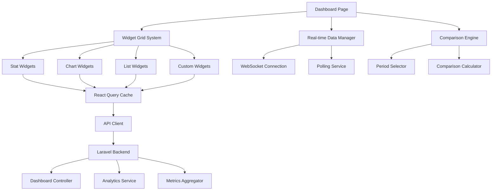
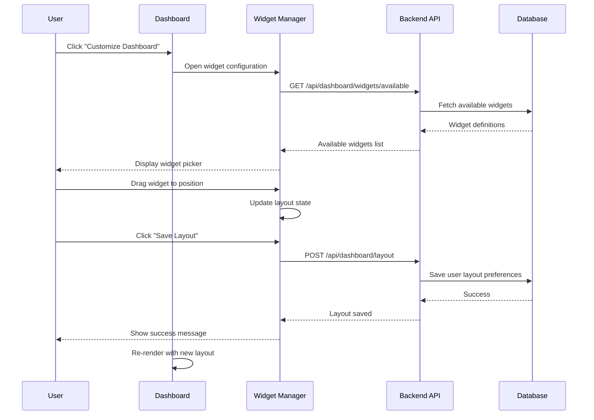
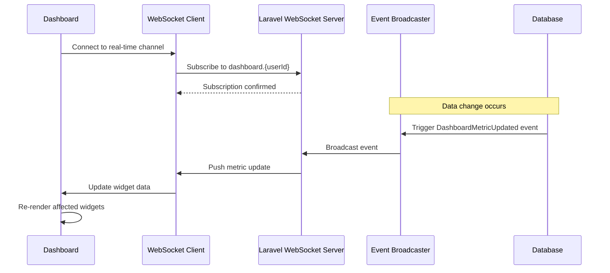

# Design Document: Dashboard Enhancements

## Overview

This design enhances the existing church management system dashboard with improved visualizations, modern layouts, and interactive features. The enhancement focuses on providing deeper insights through advanced analytics, customizable widgets, real-time updates, and comparison views while maintaining the existing dark mode support and modern UI/UX standards.

## Architecture

The enhanced dashboard follows a modular, component-based architecture with clear separation between data fetching, state management, and presentation layers.



## Sequence Diagrams

### Widget Customization Flow



### Real-time Data Update Flow




## Components and Interfaces

### Component 1: WidgetGrid

**Purpose**: Manages the layout and positioning of dashboard widgets with drag-and-drop functionality

**Interface**:
```typescript
interface WidgetGridProps {
  layout: WidgetLayout[];
  widgets: Widget[];
  editable: boolean;
  onLayoutChange: (layout: WidgetLayout[]) => void;
}

interface WidgetLayout {
  id: string;
  x: number;
  y: number;
  w: number;
  h: number;
  minW?: number;
  minH?: number;
  maxW?: number;
  maxH?: number;
}

interface Widget {
  id: string;
  type: WidgetType;
  title: string;
  config: WidgetConfig;
  refreshInterval?: number;
}

type WidgetType = 
  | 'stat-card'
  | 'line-chart'
  | 'bar-chart'
  | 'pie-chart'
  | 'area-chart'
  | 'activity-feed'
  | 'event-list'
  | 'member-growth'
  | 'giving-patterns'
  | 'attendance-analytics';
```

**Responsibilities**:
- Render widgets in a responsive grid layout
- Handle drag-and-drop repositioning
- Manage widget resize operations
- Persist layout changes to backend
- Support mobile-responsive breakpoints

### Component 2: MemberGrowthChart

**Purpose**: Visualizes member growth trends with multiple time periods and comparison views

**Interface**:
```typescript
interface MemberGrowthChartProps {
  period: TimePeriod;
  comparisonPeriod?: TimePeriod;
  showComparison: boolean;
  breakdown?: 'total' | 'by-status' | 'by-age-group' | 'by-ministry';
}

interface TimePeriod {
  start: Date;
  end: Date;
  label: string;
}

interface MemberGrowthData {
  date: string;
  total: number;
  active: number;
  inactive: number;
  visitors: number;
  newMembers: number;
  ageGroups?: Record<string, number>;
  ministries?: Record<string, number>;
}
```

**Responsibilities**:
- Fetch and display member growth data
- Support multiple breakdown views
- Enable period-over-period comparisons
- Provide interactive tooltips with detailed metrics
- Export data to CSV/PDF

### Component 3: GivingPatternsWidget

**Purpose**: Analyzes and visualizes giving patterns with trends and insights

**Interface**:
```typescript
interface GivingPatternsWidgetProps {
  period: TimePeriod;
  groupBy: 'day' | 'week' | 'month' | 'quarter';
  showTrends: boolean;
  showProjections: boolean;
}

interface GivingPattern {
  period: string;
  totalAmount: number;
  offeringCount: number;
  averageAmount: number;
  uniqueGivers: number;
  recurringGivers: number;
  byType: Record<string, number>;
  trend: TrendIndicator;
}

interface TrendIndicator {
  direction: 'up' | 'down' | 'stable';
  percentage: number;
  comparison: string;
}
```

**Responsibilities**:
- Display giving patterns over time
- Calculate and show trends
- Identify recurring vs one-time givers
- Provide giving projections
- Highlight anomalies or significant changes


### Component 4: EventAttendanceAnalytics

**Purpose**: Provides detailed analytics on event attendance patterns and trends

**Interface**:
```typescript
interface EventAttendanceAnalyticsProps {
  period: TimePeriod;
  eventTypes?: string[];
  showPredictions: boolean;
}

interface EventAttendanceData {
  eventId: string;
  eventTitle: string;
  eventType: string;
  date: string;
  expectedAttendance: number;
  actualAttendance: number;
  attendanceRate: number;
  repeatAttendees: number;
  newAttendees: number;
  demographics: AttendanceDemographics;
}

interface AttendanceDemographics {
  byAgeGroup: Record<string, number>;
  byGender: Record<string, number>;
  byMembershipStatus: Record<string, number>;
}
```

**Responsibilities**:
- Track attendance across different event types
- Compare expected vs actual attendance
- Identify attendance patterns
- Provide demographic breakdowns
- Generate attendance predictions

### Component 5: ComparisonSelector

**Purpose**: Allows users to select time periods for comparison analysis

**Interface**:
```typescript
interface ComparisonSelectorProps {
  currentPeriod: TimePeriod;
  onComparisonChange: (comparison: ComparisonConfig) => void;
}

interface ComparisonConfig {
  enabled: boolean;
  type: 'previous-period' | 'same-period-last-year' | 'custom';
  customPeriod?: TimePeriod;
}
```

**Responsibilities**:
- Provide preset comparison options (MoM, YoY)
- Support custom period selection
- Calculate appropriate comparison periods
- Validate period selections

### Component 6: RealTimeMetricCard

**Purpose**: Displays real-time updating metrics with live data

**Interface**:
```typescript
interface RealTimeMetricCardProps {
  metricKey: string;
  title: string;
  icon: LucideIcon;
  format: 'number' | 'currency' | 'percentage';
  updateInterval?: number;
  showHistory?: boolean;
}

interface RealTimeMetric {
  value: number;
  timestamp: Date;
  change: number;
  changePercentage: number;
  history: MetricHistoryPoint[];
}

interface MetricHistoryPoint {
  timestamp: Date;
  value: number;
}
```

**Responsibilities**:
- Subscribe to real-time metric updates
- Display current value with formatting
- Show change indicators
- Render mini sparkline of recent history
- Handle connection status


## Data Models

### Model 1: DashboardLayout

```typescript
interface DashboardLayout {
  id: string;
  userId: string;
  name: string;
  isDefault: boolean;
  widgets: WidgetConfiguration[];
  createdAt: Date;
  updatedAt: Date;
}

interface WidgetConfiguration {
  widgetId: string;
  type: WidgetType;
  position: WidgetPosition;
  settings: WidgetSettings;
}

interface WidgetPosition {
  x: number;
  y: number;
  width: number;
  height: number;
}

interface WidgetSettings {
  title?: string;
  refreshInterval?: number;
  filters?: Record<string, any>;
  displayOptions?: Record<string, any>;
}
```

**Validation Rules**:
- userId must reference valid user
- At least one widget required
- Widget positions must not overlap
- Width and height must be positive integers
- Only one default layout per user

### Model 2: DashboardMetric

```typescript
interface DashboardMetric {
  id: string;
  key: string;
  category: MetricCategory;
  value: number;
  metadata: Record<string, any>;
  timestamp: Date;
  period: string;
}

type MetricCategory = 
  | 'membership'
  | 'finance'
  | 'attendance'
  | 'events'
  | 'engagement';
```

**Validation Rules**:
- key must be unique per period
- timestamp must not be in future
- value must be numeric
- category must be valid enum value

### Model 3: AnalyticsSnapshot

```typescript
interface AnalyticsSnapshot {
  id: string;
  snapshotDate: Date;
  metrics: MetricSnapshot[];
  comparisons: ComparisonData[];
  insights: GeneratedInsight[];
}

interface MetricSnapshot {
  key: string;
  value: number;
  change: number;
  changePercentage: number;
}

interface ComparisonData {
  metric: string;
  currentValue: number;
  comparisonValue: number;
  comparisonPeriod: string;
  variance: number;
  variancePercentage: number;
}

interface GeneratedInsight {
  type: 'trend' | 'anomaly' | 'milestone' | 'recommendation';
  severity: 'info' | 'warning' | 'success';
  title: string;
  description: string;
  actionable: boolean;
  actionUrl?: string;
}
```

**Validation Rules**:
- snapshotDate must be unique
- All metric values must be numeric
- Comparison periods must be valid date ranges
- Insights must have non-empty title and description


## API Endpoints

### GET /api/dashboard/widgets/available
**Purpose**: Retrieve list of available widget types and their configurations

**Request**: None

**Response**:
```typescript
{
  success: boolean;
  data: {
    widgets: WidgetDefinition[];
  }
}

interface WidgetDefinition {
  type: WidgetType;
  name: string;
  description: string;
  icon: string;
  defaultSize: { width: number; height: number };
  minSize: { width: number; height: number };
  maxSize: { width: number; height: number };
  configurableOptions: ConfigOption[];
}
```

### GET /api/dashboard/layout
**Purpose**: Retrieve user's dashboard layout configuration

**Request**: None (uses authenticated user)

**Response**:
```typescript
{
  success: boolean;
  data: DashboardLayout;
}
```

### POST /api/dashboard/layout
**Purpose**: Save or update user's dashboard layout

**Request**:
```typescript
{
  name: string;
  isDefault: boolean;
  widgets: WidgetConfiguration[];
}
```

**Response**:
```typescript
{
  success: boolean;
  data: DashboardLayout;
  message: string;
}
```

### GET /api/dashboard/analytics/member-growth
**Purpose**: Retrieve member growth analytics data

**Request Parameters**:
- `start_date`: ISO date string
- `end_date`: ISO date string
- `breakdown`: 'total' | 'by-status' | 'by-age-group' | 'by-ministry'
- `comparison_period`: optional ISO date range

**Response**:
```typescript
{
  success: boolean;
  data: {
    current: MemberGrowthData[];
    comparison?: MemberGrowthData[];
    summary: {
      totalGrowth: number;
      growthRate: number;
      netChange: number;
    };
  }
}
```

### GET /api/dashboard/analytics/giving-patterns
**Purpose**: Retrieve giving patterns and trends

**Request Parameters**:
- `start_date`: ISO date string
- `end_date`: ISO date string
- `group_by`: 'day' | 'week' | 'month' | 'quarter'
- `include_projections`: boolean

**Response**:
```typescript
{
  success: boolean;
  data: {
    patterns: GivingPattern[];
    projections?: GivingProjection[];
    insights: GeneratedInsight[];
  }
}
```

### GET /api/dashboard/analytics/event-attendance
**Purpose**: Retrieve event attendance analytics

**Request Parameters**:
- `start_date`: ISO date string
- `end_date`: ISO date string
- `event_types`: comma-separated string
- `include_predictions`: boolean

**Response**:
```typescript
{
  success: boolean;
  data: {
    events: EventAttendanceData[];
    trends: AttendanceTrend[];
    predictions?: AttendancePrediction[];
  }
}
```

### GET /api/dashboard/metrics/realtime
**Purpose**: Retrieve current real-time metrics

**Request Parameters**:
- `metrics`: comma-separated list of metric keys

**Response**:
```typescript
{
  success: boolean;
  data: {
    metrics: Record<string, RealTimeMetric>;
    timestamp: string;
  }
}
```

### GET /api/dashboard/comparison
**Purpose**: Get comparison data for specified periods

**Request Parameters**:
- `metric_keys`: comma-separated metric keys
- `current_start`: ISO date string
- `current_end`: ISO date string
- `comparison_start`: ISO date string
- `comparison_end`: ISO date string

**Response**:
```typescript
{
  success: boolean;
  data: {
    comparisons: ComparisonData[];
    insights: GeneratedInsight[];
  }
}
```


## State Management Approach

### Zustand Store: dashboardStore

```typescript
interface DashboardStore {
  // Layout state
  layout: DashboardLayout | null;
  isEditMode: boolean;
  
  // Widget state
  widgets: Map<string, WidgetData>;
  loadingWidgets: Set<string>;
  
  // Comparison state
  comparisonConfig: ComparisonConfig | null;
  
  // Real-time state
  realtimeConnected: boolean;
  realtimeMetrics: Map<string, RealTimeMetric>;
  
  // Actions
  setLayout: (layout: DashboardLayout) => void;
  toggleEditMode: () => void;
  updateWidgetData: (widgetId: string, data: any) => void;
  setWidgetLoading: (widgetId: string, loading: boolean) => void;
  setComparisonConfig: (config: ComparisonConfig | null) => void;
  updateRealtimeMetric: (key: string, metric: RealTimeMetric) => void;
  setRealtimeConnected: (connected: boolean) => void;
}
```

### React Query Hooks

```typescript
// Fetch dashboard layout
const useDashboardLayout = () => {
  return useQuery({
    queryKey: ['dashboard', 'layout'],
    queryFn: fetchDashboardLayout,
    staleTime: 5 * 60 * 1000, // 5 minutes
  });
};

// Fetch member growth analytics
const useMemberGrowthAnalytics = (params: MemberGrowthParams) => {
  return useQuery({
    queryKey: ['dashboard', 'analytics', 'member-growth', params],
    queryFn: () => fetchMemberGrowthAnalytics(params),
    staleTime: 2 * 60 * 1000, // 2 minutes
  });
};

// Fetch giving patterns
const useGivingPatterns = (params: GivingPatternsParams) => {
  return useQuery({
    queryKey: ['dashboard', 'analytics', 'giving-patterns', params],
    queryFn: () => fetchGivingPatterns(params),
    staleTime: 2 * 60 * 1000,
  });
};

// Fetch event attendance analytics
const useEventAttendanceAnalytics = (params: EventAttendanceParams) => {
  return useQuery({
    queryKey: ['dashboard', 'analytics', 'event-attendance', params],
    queryFn: () => fetchEventAttendanceAnalytics(params),
    staleTime: 2 * 60 * 1000,
  });
};

// Save dashboard layout mutation
const useSaveDashboardLayout = () => {
  const queryClient = useQueryClient();
  
  return useMutation({
    mutationFn: saveDashboardLayout,
    onSuccess: () => {
      queryClient.invalidateQueries(['dashboard', 'layout']);
    },
  });
};

// Real-time metrics with polling fallback
const useRealtimeMetrics = (metricKeys: string[]) => {
  return useQuery({
    queryKey: ['dashboard', 'metrics', 'realtime', metricKeys],
    queryFn: () => fetchRealtimeMetrics(metricKeys),
    refetchInterval: 30000, // Poll every 30 seconds as fallback
    staleTime: 25000,
  });
};
```

### WebSocket Integration

```typescript
// Real-time connection manager
class DashboardRealtimeManager {
  private connection: WebSocket | null = null;
  private subscriptions: Map<string, Set<(data: any) => void>> = new Map();
  
  connect(userId: string): void {
    this.connection = new WebSocket(`/ws/dashboard/${userId}`);
    
    this.connection.onmessage = (event) => {
      const message = JSON.parse(event.data);
      this.handleMessage(message);
    };
    
    this.connection.onclose = () => {
      // Attempt reconnection with exponential backoff
      this.reconnect();
    };
  }
  
  subscribe(metricKey: string, callback: (data: any) => void): () => void {
    if (!this.subscriptions.has(metricKey)) {
      this.subscriptions.set(metricKey, new Set());
    }
    this.subscriptions.get(metricKey)!.add(callback);
    
    // Return unsubscribe function
    return () => {
      this.subscriptions.get(metricKey)?.delete(callback);
    };
  }
  
  private handleMessage(message: any): void {
    const { type, key, data } = message;
    
    if (type === 'metric-update') {
      const callbacks = this.subscriptions.get(key);
      callbacks?.forEach(callback => callback(data));
    }
  }
  
  disconnect(): void {
    this.connection?.close();
    this.connection = null;
  }
}
```


## Responsive Design Considerations

### Breakpoint Strategy

```typescript
const breakpoints = {
  mobile: '0px',      // < 640px
  tablet: '640px',    // 640px - 1024px
  desktop: '1024px',  // 1024px - 1536px
  wide: '1536px',     // > 1536px
};

// Grid columns per breakpoint
const gridColumns = {
  mobile: 1,
  tablet: 2,
  desktop: 3,
  wide: 4,
};
```

### Mobile Optimizations

1. **Widget Stacking**: On mobile, widgets stack vertically in a single column
2. **Touch Gestures**: Swipe to navigate between widget groups
3. **Simplified Charts**: Reduce data points and simplify visualizations on small screens
4. **Collapsible Sections**: Allow users to collapse widget groups to save space
5. **Bottom Sheet Modals**: Use bottom sheets instead of centered modals for better mobile UX

### Tablet Optimizations

1. **Two-Column Layout**: Display widgets in a 2-column grid
2. **Horizontal Scrolling**: Enable horizontal scroll for wide charts
3. **Adaptive Font Sizes**: Scale typography based on viewport
4. **Touch-Friendly Controls**: Larger touch targets for interactive elements

### Desktop Optimizations

1. **Multi-Column Grid**: Support 3-4 column layouts
2. **Drag-and-Drop**: Full drag-and-drop widget repositioning
3. **Hover States**: Rich hover interactions and tooltips
4. **Keyboard Navigation**: Complete keyboard accessibility

### Chart Responsiveness

```typescript
interface ResponsiveChartConfig {
  mobile: {
    height: 250;
    margin: { top: 10, right: 10, bottom: 30, left: 30 };
    fontSize: 10;
    showLegend: false;
    dataPoints: 'reduced'; // Show fewer data points
  };
  tablet: {
    height: 300;
    margin: { top: 15, right: 20, bottom: 40, left: 40 };
    fontSize: 11;
    showLegend: true;
    dataPoints: 'normal';
  };
  desktop: {
    height: 400;
    margin: { top: 20, right: 30, bottom: 50, left: 60 };
    fontSize: 12;
    showLegend: true;
    dataPoints: 'full';
  };
}
```

### Performance Considerations

1. **Lazy Loading**: Load widgets only when visible in viewport
2. **Virtual Scrolling**: Use virtual scrolling for long lists (activity feed)
3. **Debounced Updates**: Debounce real-time updates to prevent excessive re-renders
4. **Memoization**: Memoize expensive calculations and chart data transformations
5. **Code Splitting**: Split widget components into separate chunks
6. **Image Optimization**: Use optimized images and lazy loading for charts
7. **Request Batching**: Batch multiple metric requests into single API call

### Accessibility Considerations

1. **ARIA Labels**: Comprehensive ARIA labels for all interactive elements
2. **Keyboard Navigation**: Full keyboard support for widget management
3. **Screen Reader Support**: Announce data updates and changes
4. **Focus Management**: Proper focus management in edit mode
5. **Color Contrast**: Maintain WCAG AA contrast ratios in all themes
6. **Reduced Motion**: Respect prefers-reduced-motion for animations


## Correctness Properties

### Property 1: Layout Persistence
**Universal Quantification**: For all users U and dashboard layouts L, if L is saved for U, then retrieving the layout for U returns L with all widget configurations intact.

**Formal Statement**:
```
∀ user U, layout L:
  saveLayout(U, L) ⟹ getLayout(U) = L ∧ 
  ∀ widget W ∈ L.widgets: W.position ∈ validPositions ∧ W.settings ∈ validSettings
```

**Test Strategy**: Property-based test generating random layouts and verifying persistence

### Property 2: Real-time Data Consistency
**Universal Quantification**: For all metrics M and time periods T, if a metric update occurs at time t, then all subscribed clients receive the update within acceptable latency threshold.

**Formal Statement**:
```
∀ metric M, time t, clients C:
  updateMetric(M, t) ⟹ 
  ∀ client c ∈ C: receivedUpdate(c, M, t') where (t' - t) ≤ latencyThreshold
```

**Test Strategy**: Integration test with multiple WebSocket clients verifying update propagation

### Property 3: Comparison Accuracy
**Universal Quantification**: For all metrics M and comparison periods P1, P2, the calculated variance equals the actual difference between period values.

**Formal Statement**:
```
∀ metric M, periods P1, P2:
  let v1 = getValue(M, P1)
  let v2 = getValue(M, P2)
  let variance = calculateVariance(M, P1, P2)
  ⟹ variance = v1 - v2 ∧ variancePercentage = ((v1 - v2) / v2) × 100
```

**Test Strategy**: Property-based test with various metric values and periods

### Property 4: Widget Data Isolation
**Universal Quantification**: For all widgets W1, W2 on a dashboard, data updates to W1 do not affect the data or state of W2.

**Formal Statement**:
```
∀ widgets W1, W2 where W1 ≠ W2:
  let state1 = getState(W2)
  updateWidget(W1, newData)
  let state2 = getState(W2)
  ⟹ state1 = state2
```

**Test Strategy**: Unit test verifying state isolation between widgets

### Property 5: Responsive Layout Validity
**Universal Quantification**: For all viewport sizes V and layouts L, the rendered layout maintains non-overlapping widgets and respects minimum size constraints.

**Formal Statement**:
```
∀ viewport V, layout L:
  let rendered = renderLayout(L, V)
  ⟹ ∀ widgets W1, W2 ∈ rendered where W1 ≠ W2:
    ¬overlaps(W1, W2) ∧
    W1.width ≥ W1.minWidth ∧
    W1.height ≥ W1.minHeight
```

**Test Strategy**: Visual regression tests across multiple viewport sizes

### Property 6: Data Aggregation Correctness
**Universal Quantification**: For all time periods T and aggregation functions F, the aggregated value equals the result of applying F to all data points in T.

**Formal Statement**:
```
∀ period T, aggregation F, metric M:
  let dataPoints = getDataPoints(M, T)
  let aggregated = aggregate(M, T, F)
  ⟹ aggregated = F(dataPoints)
```

**Test Strategy**: Property-based test with various aggregation functions (sum, average, count)


## Error Handling

### Error Scenario 1: Widget Data Fetch Failure

**Condition**: API request for widget data fails due to network error or server error

**Response**: 
- Display error state within the widget container
- Show retry button with exponential backoff
- Log error to monitoring service
- Preserve last known good data if available

**Recovery**:
- Automatic retry with exponential backoff (1s, 2s, 4s, 8s)
- Manual retry via user action
- Fallback to cached data if available
- Graceful degradation to skeleton state

### Error Scenario 2: Layout Save Failure

**Condition**: Saving dashboard layout fails due to validation error or server error

**Response**:
- Show error toast notification with specific error message
- Revert layout to last saved state
- Preserve unsaved changes in local storage
- Offer option to retry save

**Recovery**:
- Retry save operation
- Validate layout before sending to server
- Restore from local storage on page reload
- Provide export option to save layout locally

### Error Scenario 3: WebSocket Connection Loss

**Condition**: Real-time WebSocket connection is lost or fails to establish

**Response**:
- Display connection status indicator
- Switch to polling fallback automatically
- Show notification about degraded real-time functionality
- Attempt reconnection with exponential backoff

**Recovery**:
- Automatic reconnection attempts (5s, 10s, 30s, 60s intervals)
- Fallback to HTTP polling for updates
- Resume WebSocket when connection restored
- Sync missed updates on reconnection

### Error Scenario 4: Invalid Comparison Period

**Condition**: User selects comparison period with insufficient data or invalid date range

**Response**:
- Show validation error message
- Highlight invalid date inputs
- Suggest valid date ranges
- Prevent API request until valid

**Recovery**:
- Provide date picker with valid date constraints
- Show available data date ranges
- Auto-adjust to nearest valid period
- Clear comparison if cannot be resolved

### Error Scenario 5: Widget Configuration Error

**Condition**: Widget configuration is invalid or incompatible with current data

**Response**:
- Display configuration error in widget
- Show default/fallback configuration
- Provide link to widget settings
- Log configuration error details

**Recovery**:
- Reset to default configuration
- Validate configuration before applying
- Provide configuration migration for breaking changes
- Allow manual configuration correction

### Error Scenario 6: Data Aggregation Timeout

**Condition**: Complex analytics query exceeds timeout threshold

**Response**:
- Show timeout error message
- Suggest reducing date range or complexity
- Offer to run query in background
- Provide option to export raw data

**Recovery**:
- Implement query optimization
- Cache intermediate results
- Break into smaller queries
- Provide progress indicator for long queries


## Testing Strategy

### Unit Testing Approach

**Focus Areas**:
- Individual widget components
- Data transformation functions
- State management logic
- Utility functions for calculations

**Key Test Cases**:
1. Widget rendering with various data states (loading, error, success)
2. Comparison calculation accuracy
3. Date range validation
4. Layout position calculations
5. Data aggregation functions
6. Format functions (currency, percentage, numbers)

**Coverage Goals**: 90% code coverage for utility functions and state management

**Testing Tools**: Vitest, React Testing Library

### Property-Based Testing Approach

**Property Test Library**: fast-check

**Properties to Test**:

1. **Layout Persistence Property**
   - Generate random valid layouts
   - Verify save and retrieve operations preserve all data
   - Test with various widget configurations

2. **Comparison Calculation Property**
   - Generate random metric values and periods
   - Verify variance calculations are mathematically correct
   - Test edge cases (zero values, negative values)

3. **Data Aggregation Property**
   - Generate random data sets
   - Verify aggregation functions (sum, avg, count) produce correct results
   - Test with various time periods and groupings

4. **Widget Position Property**
   - Generate random widget positions
   - Verify no overlaps occur
   - Verify all positions are within grid bounds

5. **Date Range Property**
   - Generate random date ranges
   - Verify all date calculations are correct
   - Test period comparisons (MoM, YoY)

### Integration Testing Approach

**Focus Areas**:
- API integration with backend
- WebSocket real-time updates
- State synchronization across components
- User workflows (customize dashboard, compare periods)

**Key Test Scenarios**:

1. **Dashboard Customization Flow**
   - User enters edit mode
   - Adds/removes widgets
   - Repositions widgets
   - Saves layout
   - Verifies persistence

2. **Real-time Updates Flow**
   - Connect to WebSocket
   - Trigger metric update
   - Verify widget updates
   - Handle disconnection
   - Verify fallback to polling

3. **Comparison Analysis Flow**
   - Select comparison period
   - Fetch comparison data
   - Display comparison visualizations
   - Switch between comparison types
   - Export comparison report

4. **Multi-Widget Interaction**
   - Load dashboard with multiple widgets
   - Verify independent data fetching
   - Test concurrent updates
   - Verify no state interference

**Testing Tools**: Vitest, MSW (Mock Service Worker), WebSocket mock

### End-to-End Testing Approach

**Focus Areas**:
- Complete user journeys
- Cross-browser compatibility
- Performance under load
- Accessibility compliance

**Key Scenarios**:

1. First-time dashboard setup
2. Daily dashboard usage pattern
3. Dashboard customization and sharing
4. Mobile responsive behavior
5. Dark mode switching
6. Export functionality

**Testing Tools**: Playwright or Cypress

### Performance Testing

**Metrics to Monitor**:
- Initial page load time (< 2s)
- Time to interactive (< 3s)
- Widget render time (< 500ms per widget)
- Real-time update latency (< 1s)
- Memory usage over time
- Bundle size (< 500KB for dashboard chunk)

**Testing Approach**:
- Lighthouse CI for performance budgets
- React DevTools Profiler for render performance
- Chrome DevTools for memory profiling
- Load testing with multiple concurrent users

### Accessibility Testing

**Testing Approach**:
- Automated testing with axe-core
- Manual keyboard navigation testing
- Screen reader testing (NVDA, JAWS, VoiceOver)
- Color contrast verification
- Focus management verification

**Compliance Target**: WCAG 2.1 Level AA


## Performance Considerations

### Frontend Optimization

1. **Code Splitting**
   - Split dashboard widgets into separate chunks
   - Lazy load widgets on demand
   - Use React.lazy() and Suspense for dynamic imports
   - Target: < 100KB initial bundle for dashboard

2. **Memoization Strategy**
   - Memoize expensive chart data transformations
   - Use React.memo for widget components
   - Implement useMemo for derived state
   - Cache comparison calculations

3. **Virtual Scrolling**
   - Implement virtual scrolling for activity feed
   - Use react-window for long lists
   - Render only visible items
   - Target: Smooth scrolling with 1000+ items

4. **Debouncing and Throttling**
   - Debounce widget resize operations (300ms)
   - Throttle real-time metric updates (1s)
   - Debounce search and filter inputs (500ms)
   - Throttle scroll events for lazy loading

5. **Image and Asset Optimization**
   - Use WebP format for images
   - Implement lazy loading for chart images
   - Optimize SVG icons
   - Use CSS for simple graphics

### Backend Optimization

1. **Query Optimization**
   - Index frequently queried columns (date, user_id, metric_key)
   - Use database query caching for common queries
   - Implement query result pagination
   - Use eager loading for relationships

2. **Caching Strategy**
   - Cache dashboard metrics (5 minute TTL)
   - Cache analytics snapshots (15 minute TTL)
   - Use Redis for real-time metric cache
   - Implement cache warming for popular metrics

3. **Data Aggregation**
   - Pre-aggregate common metrics daily
   - Use materialized views for complex analytics
   - Implement background jobs for heavy calculations
   - Store aggregated data in separate tables

4. **API Response Optimization**
   - Compress responses with gzip
   - Implement field selection (sparse fieldsets)
   - Use pagination for large datasets
   - Return only necessary data fields

### Database Optimization

1. **Indexing Strategy**
```sql
-- Metrics table indexes
CREATE INDEX idx_metrics_key_period ON dashboard_metrics(key, period);
CREATE INDEX idx_metrics_timestamp ON dashboard_metrics(timestamp);
CREATE INDEX idx_metrics_category ON dashboard_metrics(category);

-- Layout table indexes
CREATE INDEX idx_layouts_user_default ON dashboard_layouts(user_id, is_default);

-- Analytics snapshots indexes
CREATE INDEX idx_snapshots_date ON analytics_snapshots(snapshot_date);
```

2. **Query Patterns**
   - Use covering indexes for common queries
   - Avoid N+1 queries with eager loading
   - Batch similar queries together
   - Use database-level aggregations

3. **Data Retention**
   - Archive old metrics after 2 years
   - Keep aggregated summaries indefinitely
   - Implement automatic cleanup jobs
   - Compress historical data

### Real-time Performance

1. **WebSocket Optimization**
   - Use binary protocol for metric updates
   - Batch multiple updates into single message
   - Implement message compression
   - Limit update frequency per client

2. **Broadcasting Strategy**
   - Use Redis pub/sub for message distribution
   - Implement room-based broadcasting
   - Filter updates by user permissions
   - Throttle broadcast frequency

3. **Connection Management**
   - Implement connection pooling
   - Use heartbeat to detect stale connections
   - Graceful degradation to polling
   - Limit concurrent connections per user

### Monitoring and Metrics

**Key Performance Indicators**:
- Dashboard load time: < 2 seconds
- Widget render time: < 500ms
- API response time: < 200ms (p95)
- Real-time update latency: < 1 second
- Memory usage: < 100MB per session
- CPU usage: < 30% during normal operation

**Monitoring Tools**:
- Laravel Telescope for API monitoring
- React DevTools Profiler for component performance
- Lighthouse CI for performance budgets
- New Relic or Datadog for production monitoring


## Security Considerations

### Authentication and Authorization

1. **Widget Access Control**
   - Verify user permissions before displaying sensitive widgets
   - Implement role-based widget visibility
   - Filter data based on user permissions
   - Audit widget access attempts

2. **API Security**
   - Require authentication for all dashboard endpoints
   - Implement rate limiting (100 requests/minute per user)
   - Validate all input parameters
   - Use CSRF protection for state-changing operations

3. **Data Privacy**
   - Mask sensitive financial data for non-admin users
   - Implement field-level permissions
   - Anonymize personal data in analytics
   - Comply with data protection regulations

### WebSocket Security

1. **Connection Authentication**
   - Require valid JWT token for WebSocket connection
   - Verify user identity on connection
   - Implement connection timeout (30 minutes)
   - Re-authenticate on reconnection

2. **Message Validation**
   - Validate all incoming messages
   - Sanitize message content
   - Implement message rate limiting
   - Reject malformed messages

3. **Channel Authorization**
   - Verify user can access requested channels
   - Implement private channels per user
   - Prevent channel enumeration
   - Audit channel subscriptions

### Data Security

1. **Input Validation**
   - Validate all widget configurations
   - Sanitize user-provided widget titles
   - Validate date ranges and numeric inputs
   - Prevent SQL injection in dynamic queries

2. **Output Encoding**
   - Escape all user-generated content
   - Sanitize HTML in widget descriptions
   - Prevent XSS in custom widget titles
   - Use Content Security Policy headers

3. **Data Encryption**
   - Encrypt sensitive data at rest
   - Use HTTPS for all API communications
   - Encrypt WebSocket connections (WSS)
   - Secure storage of API keys and secrets

### Audit and Compliance

1. **Activity Logging**
   - Log all dashboard layout changes
   - Track widget configuration modifications
   - Record data export operations
   - Monitor suspicious access patterns

2. **Compliance Requirements**
   - GDPR compliance for EU users
   - Data retention policies
   - Right to data export
   - Right to be forgotten

### Threat Mitigation

**Threat 1: Unauthorized Data Access**
- Mitigation: Implement strict permission checks at API level
- Mitigation: Filter data based on user roles
- Mitigation: Audit all data access attempts

**Threat 2: Data Injection Attacks**
- Mitigation: Use parameterized queries
- Mitigation: Validate and sanitize all inputs
- Mitigation: Implement input length limits

**Threat 3: Session Hijacking**
- Mitigation: Use secure, httpOnly cookies
- Mitigation: Implement session timeout
- Mitigation: Regenerate session on privilege change

**Threat 4: Denial of Service**
- Mitigation: Implement rate limiting
- Mitigation: Set query timeout limits
- Mitigation: Limit concurrent connections
- Mitigation: Use CDN for static assets


## Dependencies

### Frontend Dependencies

**Core Libraries**:
- React 18.x - UI framework
- TypeScript 5.x - Type safety
- Tailwind CSS 3.x - Styling (already in project)
- Zustand 4.x - State management (already in project)
- React Query 5.x - Data fetching (already in project)

**Visualization Libraries**:
- Recharts 2.x - Chart library (already in project)
- react-grid-layout 1.x - Drag-and-drop grid system
- date-fns 3.x - Date manipulation
- numeral 2.x - Number formatting

**Real-time Communication**:
- socket.io-client 4.x - WebSocket client
- OR Laravel Echo - Laravel WebSocket integration

**Utilities**:
- lodash-es 4.x - Utility functions
- fast-check 3.x - Property-based testing
- react-window 1.x - Virtual scrolling

### Backend Dependencies

**Core Framework**:
- Laravel 10.x - PHP framework (already in project)
- PHP 8.2+ - Programming language

**Real-time Features**:
- Laravel WebSockets OR Pusher - WebSocket server
- Redis 7.x - Pub/sub and caching

**Database**:
- MySQL 8.x OR PostgreSQL 15.x - Primary database
- Redis 7.x - Cache and session storage

**Analytics and Processing**:
- Laravel Horizon - Queue management
- Laravel Telescope - Debugging and monitoring

**Testing**:
- PHPUnit 10.x - Unit testing
- Pest 2.x - Testing framework (optional)

### External Services

**Optional Integrations**:
- Pusher - Managed WebSocket service (alternative to self-hosted)
- Redis Cloud - Managed Redis (alternative to self-hosted)
- AWS S3 - Export file storage
- SendGrid/Mailgun - Email notifications for insights

### Development Dependencies

**Frontend**:
- Vite 5.x - Build tool (already in project)
- Vitest 1.x - Testing framework (already in project)
- @testing-library/react - Component testing (already in project)
- MSW 2.x - API mocking
- Playwright OR Cypress - E2E testing

**Backend**:
- Laravel Pint - Code formatting
- PHPStan - Static analysis
- Laravel Debugbar - Development debugging

### Infrastructure Requirements

**Minimum Requirements**:
- PHP 8.2+
- Node.js 18+
- MySQL 8.0+ OR PostgreSQL 15+
- Redis 7.0+
- 2GB RAM minimum
- 10GB storage

**Recommended Requirements**:
- PHP 8.3+
- Node.js 20+
- MySQL 8.0+ with InnoDB
- Redis 7.0+ with persistence
- 4GB RAM
- 20GB storage
- CDN for static assets

### Browser Support

**Supported Browsers**:
- Chrome 90+ (primary target)
- Firefox 88+
- Safari 14+
- Edge 90+
- Mobile Safari 14+
- Chrome Mobile 90+

**Not Supported**:
- Internet Explorer (any version)
- Legacy Edge (pre-Chromium)

