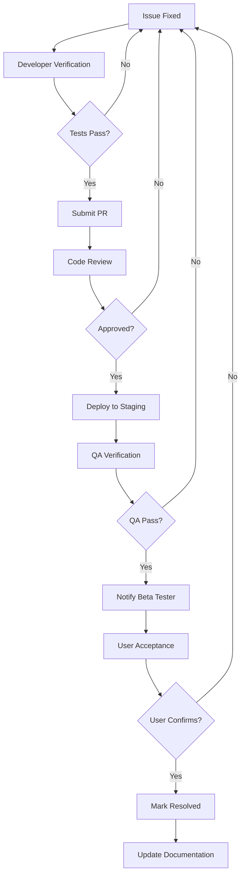

# Feedback Iteration Workflow

## Overview

This document defines the systematic process for iterating on beta feedback, implementing fixes, and conducting follow-up testing rounds. It builds on the feedback analysis tools from Task 29.2 and provides a structured approach to ensure all critical issues are resolved before production deployment.

## Iteration Workflow Phases

### Phase 1: Issue Identification and Prioritization

**Duration**: 1-2 days

**Activities**:
1. Export latest feedback data
2. Run automated analysis
3. Review prioritized issues
4. Validate priority scores
5. Create iteration backlog

**Tools**:
```bash
# Export feedback from database
php artisan beta:export-feedback

# Generate analysis report
npm run feedback:report

# Review in dashboard
# URL: /admin/beta-feedback-analysis
```

**Deliverables**:
- Prioritized issue list
- Iteration backlog (Tier 1 and Tier 2 issues)
- Resource allocation plan

### Phase 2: Fix Implementation

**Duration**: 1-2 weeks (depending on issue count)

**Activities**:
1. Assign issues to developers
2. Implement fixes
3. Write/update tests
4. Code review
5. Update issue status

**Workflow**:
```
1. Developer picks highest priority issue
2. Create feature branch: fix/issue-{id}-{description}
3. Implement fix
4. Write tests (unit, integration, or property tests)
5. Run test suite: npm run test
6. Submit pull request
7. Code review by peer
8. Merge to staging branch
9. Update issue status to "In Progress" → "Resolved"
```

**Quality Gates**:
- All tests pass
- Code review approved
- No new regressions introduced
- Fix verified in local environment

### Phase 3: Verification and Testing

**Duration**: 3-5 days

**Activities**:
1. Deploy fixes to staging
2. QA team verification
3. Beta tester confirmation
4. Regression testing
5. Update feedback status

**Verification Checklist**:
```markdown
For each fixed issue:
- [ ] Fix deployed to staging environment
- [ ] QA team verified fix works as expected
- [ ] Original reporter confirmed resolution
- [ ] No new issues introduced
- [ ] Related functionality still works
- [ ] Documentation updated if needed
- [ ] Issue status updated to "Resolved"
```

**Testing Approach**:
- **Smoke Testing**: Verify critical paths still work
- **Regression Testing**: Ensure no new bugs introduced
- **User Acceptance**: Beta testers confirm fixes
- **Performance Testing**: No performance degradation

### Phase 4: Communication and Documentation

**Duration**: 1 day

**Activities**:
1. Notify beta testers of fixes
2. Update release notes
3. Document known issues
4. Update user guide if needed
5. Prepare for next iteration

**Communication Templates**:

**To Beta Testers (Fixes Deployed)**:
```
Subject: Beta Update - Fixes Deployed

Hi Beta Testers,

We've deployed fixes for the following issues you reported:

✅ Fixed: [Issue #1 - Description]
✅ Fixed: [Issue #2 - Description]
✅ Fixed: [Issue #3 - Description]

Please verify these fixes and let us know if you encounter any issues.

Thank you for your continued feedback!
```

**To Development Team (Iteration Complete)**:
```
Iteration Summary:
- Issues Fixed: 12
- Tier 1 (Critical): 2
- Tier 2 (High): 5
- Tier 3 (Medium): 5
- Remaining Open: 8
- Next Iteration: [Date]
```

## Fix Verification Procedures

### Verification Levels

#### Level 1: Developer Verification
**Who**: Original developer
**When**: Before submitting PR
**What**:
- Fix works in local environment
- Tests pass
- No console errors
- Meets acceptance criteria

#### Level 2: Code Review
**Who**: Peer developer
**When**: During PR review
**What**:
- Code quality and standards
- Test coverage adequate
- No security issues
- Performance considerations

#### Level 3: QA Verification
**Who**: QA team
**When**: After deployment to staging
**What**:
- Fix works as expected
- No regressions introduced
- Edge cases handled
- Cross-browser compatibility

#### Level 4: User Acceptance
**Who**: Original reporter (beta tester)
**When**: After QA verification
**What**:
- Issue is resolved from user perspective
- Meets user expectations
- No new issues introduced
- User satisfaction

### Verification Workflow



### Verification Checklist Template

```markdown
## Issue #[ID]: [Title]

### Developer Verification
- [ ] Fix implemented and tested locally
- [ ] All tests pass (npm run test)
- [ ] No console errors or warnings
- [ ] Code follows project standards
- [ ] Meets acceptance criteria

### Code Review
- [ ] Code reviewed by: [Reviewer Name]
- [ ] Code quality approved
- [ ] Test coverage adequate
- [ ] No security concerns
- [ ] Performance acceptable

### QA Verification
- [ ] Deployed to staging: [Date/Time]
- [ ] QA tested by: [QA Name]
- [ ] Fix works as expected
- [ ] No regressions found
- [ ] Cross-browser tested (Chrome, Firefox, Safari, Edge)
- [ ] Mobile tested (if applicable)

### User Acceptance
- [ ] Beta tester notified: [Date]
- [ ] User confirmed fix: [Date]
- [ ] User satisfaction: [Satisfied/Needs Improvement]
- [ ] Additional feedback: [Notes]

### Documentation
- [ ] Release notes updated
- [ ] User guide updated (if needed)
- [ ] Known issues list updated
- [ ] Issue status updated to "Resolved"

**Verified By**: [Name]  
**Date**: [Date]  
**Status**: ✅ Verified / ❌ Failed / ⏳ Pending
```

## Regression Testing Protocols

### Regression Test Suite

#### Critical Path Tests
**Frequency**: After every deployment
**Scope**: Core functionality that must always work

**Test Cases**:
1. **Authentication**
   - Login with valid credentials
   - Logout
   - Session persistence

2. **Navigation**
   - Access all main pages
   - Sidebar navigation
   - Breadcrumb navigation

3. **Data Operations**
   - Create new record (member, event, etc.)
   - Read/view existing records
   - Update existing records
   - Delete/archive records

4. **Finance Operations**
   - Record offering
   - Add expense
   - View reports
   - Budget tracking

5. **Search and Filters**
   - Search functionality
   - Filter by various criteria
   - Sort tables

#### Automated Regression Tests

**Location**: `resources/js/__tests__/regression/`

**Test Files**:
- `critical-paths.test.tsx` - Core functionality
- `navigation.test.tsx` - Page navigation
- `data-operations.test.tsx` - CRUD operations
- `finance-operations.test.tsx` - Finance features
- `search-filters.test.tsx` - Search and filtering

**Run Tests**:
```bash
# Run all regression tests
npm run test:regression

# Run specific test suite
npm run test -- critical-paths.test.tsx

# Run with coverage
npm run test:coverage
```

#### Manual Regression Testing

**Checklist**: `.kiro/specs/modern-ui-ux-redesign/REGRESSION_TEST_CHECKLIST.md`

**Process**:
1. QA team follows checklist
2. Test on multiple browsers
3. Test on mobile devices
4. Document any issues found
5. Report to development team

### Regression Issue Handling

**If Regression Found**:
1. **Immediate**: Mark original fix as "Needs Revision"
2. **Priority**: Treat as Tier 1 (Blocker)
3. **Action**: Developer fixes both original issue and regression
4. **Verification**: Full verification cycle again
5. **Documentation**: Document in release notes

**Regression Report Template**:
```markdown
## Regression Report

**Original Issue**: #[ID] - [Title]
**Fix Deployed**: [Date]
**Regression Found**: [Date]

### Regression Details
**Description**: [What broke]
**Steps to Reproduce**: [How to reproduce]
**Expected Behavior**: [What should happen]
**Actual Behavior**: [What actually happens]
**Severity**: [Critical/High/Medium/Low]

### Impact
**Affected Functionality**: [What's broken]
**User Impact**: [How users are affected]
**Workaround**: [If available]

### Action Required
- [ ] Revert original fix
- [ ] Fix both original issue and regression
- [ ] Add regression test to prevent recurrence
- [ ] Re-verify entire workflow

**Assigned To**: [Developer]
**Due Date**: [ASAP for Critical, within 24 hours]
```

## Iteration Tracking

### Iteration Metrics

Track these metrics for each iteration:

**Issue Metrics**:
- Total issues at start
- Issues fixed
- Issues remaining
- New issues discovered
- Regression count

**Quality Metrics**:
- Fix success rate (% fixed on first attempt)
- Regression rate (% of fixes causing regressions)
- User satisfaction score
- Test coverage percentage

**Velocity Metrics**:
- Average fix time
- Average verification time
- Issues per developer per week
- Iteration cycle time

### Iteration Dashboard

**Location**: `/admin/beta-feedback-analysis?view=iteration`

**Displays**:
- Current iteration status
- Issues by status (New, In Progress, Resolved, Verified)
- Developer workload
- Verification queue
- Regression alerts
- Velocity trends

### Iteration Report Template

```markdown
# Iteration [Number] Report

**Period**: [Start Date] - [End Date]
**Duration**: [X] days

## Summary

- **Issues Fixed**: [X]
- **Issues Remaining**: [X]
- **Regressions Found**: [X]
- **New Issues**: [X]

## Issues by Tier

### Tier 1 (Critical)
- Started: [X]
- Fixed: [X]
- Remaining: [X]

### Tier 2 (High Priority)
- Started: [X]
- Fixed: [X]
- Remaining: [X]

### Tier 3 (Medium Priority)
- Started: [X]
- Fixed: [X]
- Remaining: [X]

## Fixed Issues

1. **#[ID]**: [Title]
   - Severity: [Level]
   - Fixed by: [Developer]
   - Verified: ✅

2. **#[ID]**: [Title]
   - Severity: [Level]
   - Fixed by: [Developer]
   - Verified: ✅

## Remaining Issues

1. **#[ID]**: [Title]
   - Severity: [Level]
   - Status: [In Progress/Blocked]
   - Assigned: [Developer]
   - ETA: [Date]

## Regressions

[None / List of regressions found]

## New Issues Discovered

[None / List of new issues]

## Metrics

- **Fix Success Rate**: [X]%
- **Regression Rate**: [X]%
- **Average Fix Time**: [X] hours
- **Test Coverage**: [X]%

## Blockers

[None / List of blockers]

## Next Iteration Plan

- **Start Date**: [Date]
- **Focus**: [Tier 1 issues / Tier 2 issues / etc.]
- **Goals**: [Specific goals]

## Notes

[Any additional notes or observations]

---

**Prepared By**: [Name]
**Date**: [Date]
```

## Decision Points

### When to Start Next Iteration

**Criteria**:
- All Tier 1 issues from current iteration resolved
- At least 80% of Tier 2 issues resolved
- No critical regressions outstanding
- Beta testers have verified fixes

**If Criteria Not Met**:
- Extend current iteration
- Add resources if needed
- Re-prioritize remaining issues
- Communicate delay to stakeholders

### When to Stop Iterating

**Production Ready Criteria**:
1. ✅ Zero unresolved Tier 1 issues
2. ✅ All Tier 2 issues resolved or have workarounds
3. ✅ Resolution rate > 80%
4. ✅ No new critical issues in last 3 days
5. ✅ Regression rate < 5%
6. ✅ Beta testers report positive experience
7. ✅ All fixes verified by QA and users
8. ✅ Documentation complete

**If Not Ready**:
- Continue iterations
- Focus on remaining Tier 1 and Tier 2 issues
- Consider partial rollout
- Delay production deployment

### When to Defer an Issue

**Defer to Post-Launch If**:
- Tier 3 or Tier 4 priority
- Enhancement request (not a bug)
- Complex implementation (> 1 week)
- Low user impact
- Workaround available
- Resource constraints

**Document Deferred Issues**:
- Add to post-launch backlog
- Document in known issues list
- Communicate to beta testers
- Set expectations on timeline

## Communication Plan

### Daily Updates

**To**: Development team
**Format**: Standup meeting or Slack update
**Content**:
- Issues fixed yesterday
- Issues in progress today
- Blockers or concerns
- Help needed

### Weekly Updates

**To**: Beta testers
**Format**: Email
**Content**:
- Fixes deployed this week
- Issues still in progress
- New issues discovered
- Next steps

**To**: Stakeholders
**Format**: Status report
**Content**:
- Iteration progress
- Metrics and trends
- Production readiness assessment
- Timeline updates

### Iteration Complete

**To**: All stakeholders
**Format**: Iteration report
**Content**:
- Summary of fixes
- Remaining issues
- Metrics and quality indicators
- Next iteration plan or production readiness

## Tools and Scripts

### Iteration Management Scripts

#### Start New Iteration

**File**: `resources/js/scripts/start-iteration.ts`

```typescript
/**
 * Start a new iteration
 * - Export current feedback
 * - Generate iteration plan
 * - Create iteration report template
 * - Notify team
 */
```

**Usage**:
```bash
npm run iteration:start
```

#### Track Iteration Progress

**File**: `resources/js/scripts/track-iteration.ts`

```typescript
/**
 * Track iteration progress
 * - Calculate metrics
 * - Generate progress report
 * - Identify blockers
 * - Update dashboard
 */
```

**Usage**:
```bash
npm run iteration:track
```

#### Complete Iteration

**File**: `resources/js/scripts/complete-iteration.ts`

```typescript
/**
 * Complete an iteration
 * - Generate final report
 * - Archive iteration data
 * - Prepare for next iteration
 * - Notify stakeholders
 */
```

**Usage**:
```bash
npm run iteration:complete
```

### Verification Scripts

#### Run Verification Checklist

**File**: `resources/js/scripts/verify-fix.ts`

```typescript
/**
 * Verify a fix
 * - Run automated tests
 * - Check for regressions
 * - Generate verification report
 * - Update issue status
 */
```

**Usage**:
```bash
npm run verify:fix -- --issue=123
```

#### Run Regression Tests

**File**: `resources/js/scripts/run-regression-tests.ts`

```typescript
/**
 * Run regression test suite
 * - Execute critical path tests
 * - Check for new issues
 * - Generate regression report
 * - Alert if regressions found
 */
```

**Usage**:
```bash
npm run test:regression
```

## Best Practices

### Do's

✅ **Prioritize ruthlessly**: Focus on Tier 1 and Tier 2 issues first
✅ **Verify thoroughly**: Don't skip verification steps
✅ **Communicate frequently**: Keep everyone informed
✅ **Document everything**: Track decisions and changes
✅ **Test for regressions**: Always run regression tests
✅ **Involve users**: Get beta tester confirmation
✅ **Learn from issues**: Identify patterns and root causes
✅ **Celebrate progress**: Acknowledge team achievements

### Don'ts

❌ **Don't rush fixes**: Quality over speed
❌ **Don't skip tests**: Tests prevent regressions
❌ **Don't ignore feedback**: Every report is valuable
❌ **Don't work in isolation**: Collaborate with team
❌ **Don't defer critical issues**: Fix blockers immediately
❌ **Don't forget documentation**: Update as you go
❌ **Don't burn out**: Pace yourself and team
❌ **Don't lose sight of goal**: Production-ready system

## Success Criteria

An iteration is successful when:

1. ✅ All planned issues are resolved
2. ✅ All fixes are verified by QA and users
3. ✅ No critical regressions introduced
4. ✅ Test coverage maintained or improved
5. ✅ Documentation updated
6. ✅ Beta testers satisfied with fixes
7. ✅ Team velocity maintained
8. ✅ Ready for next iteration or production

## Appendix: Example Iteration

### Iteration 1 Example

**Duration**: March 1-14, 2026 (2 weeks)

**Starting State**:
- Total Issues: 25
- Tier 1 (Critical): 2
- Tier 2 (High): 5
- Tier 3 (Medium): 10
- Tier 4 (Low): 8

**Iteration Plan**:
- Fix all Tier 1 issues (2)
- Fix all Tier 2 issues (5)
- Fix high-impact Tier 3 issues (3)
- Total planned: 10 issues

**Week 1 Progress**:
- Fixed: 6 issues (2 Tier 1, 4 Tier 2)
- In Progress: 4 issues
- Regressions: 1 (fixed immediately)
- New Issues: 2 (both Tier 3)

**Week 2 Progress**:
- Fixed: 5 issues (1 Tier 2, 4 Tier 3)
- Verified: All 11 fixes
- Regressions: 0
- New Issues: 1 (Tier 4)

**Final State**:
- Total Issues: 17 (25 - 11 + 3 new)
- Tier 1: 0 ✅
- Tier 2: 0 ✅
- Tier 3: 9
- Tier 4: 8

**Metrics**:
- Issues Fixed: 11
- Fix Success Rate: 91% (1 regression out of 11)
- Average Fix Time: 4 hours
- Test Coverage: 85%

**Decision**: Ready for Iteration 2 or Production (all critical issues resolved)

---

**Document Version**: 1.0  
**Created**: Task 29.3 Implementation  
**Maintained By**: Development Team
