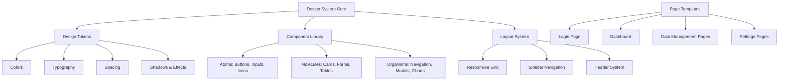
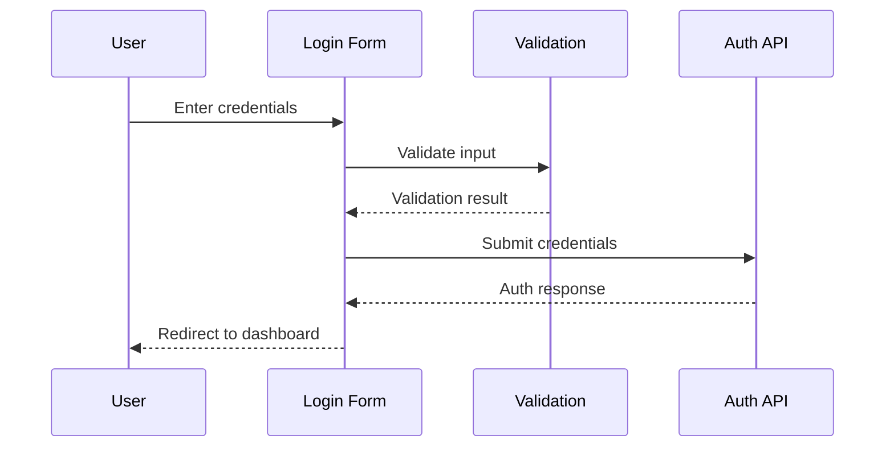

# Design Document: Modern UI/UX Redesign

## Overview

This design specification establishes a comprehensive modern UI/UX system for the Church Management System (MFMC). The redesign transforms all sections—Login, Dashboard, Members, Small Groups, Leadership, Events, Finance, Reports, Activity Log, Users, and Settings—with a cohesive, accessible, and visually appealing interface. Built on React + TypeScript + Tailwind CSS, the design system emphasizes clarity, consistency, and user experience while maintaining the existing Laravel backend architecture.

## Main Architecture



## Design System Foundation

### Color Palette


**Primary Colors** (Church Identity & Actions):
```typescript
const primaryColors = {
  50: '#f0f9ff',   // Lightest blue - backgrounds
  100: '#e0f2fe',  // Light blue - hover states
  200: '#bae6fd',  // Soft blue - borders
  300: '#7dd3fc',  // Medium blue - secondary elements
  400: '#38bdf8',  // Bright blue - interactive elements
  500: '#0ea5e9',  // Primary blue - main actions
  600: '#0284c7',  // Deep blue - primary hover
  700: '#0369a1',  // Darker blue - active states
  800: '#075985',  // Very dark blue - text on light
  900: '#0c4a6e',  // Darkest blue - headings
};
```

**Neutral Colors** (Text, Backgrounds, Borders):
```typescript
const neutralColors = {
  50: '#fafafa',   // Off-white backgrounds
  100: '#f5f5f5',  // Light gray backgrounds
  200: '#e5e5e5',  // Subtle borders
  300: '#d4d4d4',  // Medium borders
  400: '#a3a3a3',  // Disabled text
  500: '#737373',  // Secondary text
  600: '#525252',  // Body text
  700: '#404040',  // Dark text
  800: '#262626',  // Headings
  900: '#171717',  // Darkest text
};
```

**Semantic Colors** (Status & Feedback):
```typescript
const semanticColors = {
  success: {
    light: '#d1fae5',  // Success backgrounds
    DEFAULT: '#10b981', // Success actions
    dark: '#059669',   // Success hover
  },
  warning: {
    light: '#fef3c7',  // Warning backgrounds
    DEFAULT: '#f59e0b', // Warning actions
    dark: '#d97706',   // Warning hover
  },
  error: {
    light: '#fee2e2',  // Error backgrounds
    DEFAULT: '#ef4444', // Error actions
    dark: '#dc2626',   // Error hover
  },
  info: {
    light: '#dbeafe',  // Info backgrounds
    DEFAULT: '#3b82f6', // Info actions
    dark: '#2563eb',   // Info hover
  },
};
```

### Typography System

**Font Family**:
```typescript
const fontFamily = {
  sans: ['Inter', 'system-ui', '-apple-system', 'sans-serif'],
  mono: ['JetBrains Mono', 'Consolas', 'monospace'],
};
```

**Font Sizes & Line Heights**:
```typescript
const typography = {
  // Display - Hero sections
  display: {
    size: '3.75rem',    // 60px
    lineHeight: '1.1',
    weight: '700',
    letterSpacing: '-0.02em',
  },
  // Headings
  h1: {
    size: '2.25rem',    // 36px
    lineHeight: '1.2',
    weight: '700',
    letterSpacing: '-0.01em',
  },
  h2: {
    size: '1.875rem',   // 30px
    lineHeight: '1.3',
    weight: '600',
  },
  h3: {
    size: '1.5rem',     // 24px
    lineHeight: '1.4',
    weight: '600',
  },
  h4: {
    size: '1.25rem',    // 20px
    lineHeight: '1.5',
    weight: '600',
  },
  // Body text
  large: {
    size: '1.125rem',   // 18px
    lineHeight: '1.75',
    weight: '400',
  },
  base: {
    size: '1rem',       // 16px
    lineHeight: '1.5',
    weight: '400',
  },
  small: {
    size: '0.875rem',   // 14px
    lineHeight: '1.5',
    weight: '400',
  },
  tiny: {
    size: '0.75rem',    // 12px
    lineHeight: '1.5',
    weight: '400',
  },
};
```

### Spacing System

**8-Point Grid System**:
```typescript
const spacing = {
  0: '0',
  1: '0.25rem',   // 4px
  2: '0.5rem',    // 8px
  3: '0.75rem',   // 12px
  4: '1rem',      // 16px
  5: '1.25rem',   // 20px
  6: '1.5rem',    // 24px
  8: '2rem',      // 32px
  10: '2.5rem',   // 40px
  12: '3rem',     // 48px
  16: '4rem',     // 64px
  20: '5rem',     // 80px
  24: '6rem',     // 96px
};
```

### Shadows & Elevation

```typescript
const shadows = {
  sm: '0 1px 2px 0 rgba(0, 0, 0, 0.05)',
  DEFAULT: '0 1px 3px 0 rgba(0, 0, 0, 0.1), 0 1px 2px -1px rgba(0, 0, 0, 0.1)',
  md: '0 4px 6px -1px rgba(0, 0, 0, 0.1), 0 2px 4px -2px rgba(0, 0, 0, 0.1)',
  lg: '0 10px 15px -3px rgba(0, 0, 0, 0.1), 0 4px 6px -4px rgba(0, 0, 0, 0.1)',
  xl: '0 20px 25px -5px rgba(0, 0, 0, 0.1), 0 8px 10px -6px rgba(0, 0, 0, 0.1)',
  '2xl': '0 25px 50px -12px rgba(0, 0, 0, 0.25)',
  inner: 'inset 0 2px 4px 0 rgba(0, 0, 0, 0.05)',
};
```

### Border Radius

```typescript
const borderRadius = {
  none: '0',
  sm: '0.25rem',   // 4px
  DEFAULT: '0.5rem', // 8px
  md: '0.75rem',   // 12px
  lg: '1rem',      // 16px
  xl: '1.5rem',    // 24px
  '2xl': '2rem',   // 32px
  full: '9999px',  // Circular
};
```


## Component Library

### Atoms: Button Component

**Interface**:
```typescript
interface ButtonProps {
  variant?: 'primary' | 'secondary' | 'outline' | 'ghost' | 'danger';
  size?: 'sm' | 'md' | 'lg';
  fullWidth?: boolean;
  disabled?: boolean;
  loading?: boolean;
  icon?: React.ReactNode;
  iconPosition?: 'left' | 'right';
  children: React.ReactNode;
  onClick?: () => void;
}
```

**Visual Specifications**:
```typescript
const buttonStyles = {
  // Variants
  primary: {
    background: 'bg-primary-600 hover:bg-primary-700',
    text: 'text-white',
    border: 'border-transparent',
    shadow: 'shadow-sm',
    disabled: 'disabled:bg-primary-300 disabled:cursor-not-allowed',
  },
  secondary: {
    background: 'bg-neutral-100 hover:bg-neutral-200',
    text: 'text-neutral-900',
    border: 'border-transparent',
    disabled: 'disabled:bg-neutral-50 disabled:text-neutral-400',
  },
  outline: {
    background: 'bg-white hover:bg-neutral-50',
    text: 'text-neutral-700 hover:text-neutral-900',
    border: 'border border-neutral-300',
    disabled: 'disabled:bg-neutral-50 disabled:text-neutral-400',
  },
  ghost: {
    background: 'bg-transparent hover:bg-neutral-100',
    text: 'text-neutral-700 hover:text-neutral-900',
    border: 'border-transparent',
  },
  danger: {
    background: 'bg-error-600 hover:bg-error-700',
    text: 'text-white',
    border: 'border-transparent',
    shadow: 'shadow-sm',
  },
  
  // Sizes
  sm: {
    padding: 'px-3 py-1.5',
    fontSize: 'text-sm',
    height: 'h-8',
  },
  md: {
    padding: 'px-4 py-2',
    fontSize: 'text-base',
    height: 'h-10',
  },
  lg: {
    padding: 'px-6 py-3',
    fontSize: 'text-lg',
    height: 'h-12',
  },
};
```

**Implementation Example**:
```typescript
const Button: React.FC<ButtonProps> = ({
  variant = 'primary',
  size = 'md',
  fullWidth = false,
  disabled = false,
  loading = false,
  icon,
  iconPosition = 'left',
  children,
  onClick,
}) => {
  const baseClasses = 'inline-flex items-center justify-center font-medium rounded-lg transition-all duration-200 focus:outline-none focus:ring-2 focus:ring-offset-2 focus:ring-primary-500';
  
  return (
    <button
      className={cn(
        baseClasses,
        buttonStyles[variant].background,
        buttonStyles[variant].text,
        buttonStyles[variant].border,
        buttonStyles[size].padding,
        buttonStyles[size].fontSize,
        buttonStyles[size].height,
        fullWidth && 'w-full',
        disabled && buttonStyles[variant].disabled
      )}
      disabled={disabled || loading}
      onClick={onClick}
    >
      {loading && <Loader2 className="mr-2 h-4 w-4 animate-spin" />}
      {!loading && icon && iconPosition === 'left' && <span className="mr-2">{icon}</span>}
      {children}
      {!loading && icon && iconPosition === 'right' && <span className="ml-2">{icon}</span>}
    </button>
  );
};
```

### Atoms: Input Component

**Interface**:
```typescript
interface InputProps {
  type?: 'text' | 'email' | 'password' | 'number' | 'tel' | 'url';
  label?: string;
  placeholder?: string;
  value: string;
  onChange: (value: string) => void;
  error?: string;
  helperText?: string;
  disabled?: boolean;
  required?: boolean;
  icon?: React.ReactNode;
  iconPosition?: 'left' | 'right';
  fullWidth?: boolean;
}
```

**Visual Specifications**:
```typescript
const inputStyles = {
  base: 'block w-full rounded-lg border transition-colors duration-200 focus:outline-none focus:ring-2 focus:ring-offset-0',
  default: 'border-neutral-300 bg-white text-neutral-900 placeholder-neutral-400 focus:border-primary-500 focus:ring-primary-500',
  error: 'border-error-500 bg-error-50 text-error-900 placeholder-error-400 focus:border-error-500 focus:ring-error-500',
  disabled: 'bg-neutral-100 text-neutral-500 cursor-not-allowed',
  withIcon: {
    left: 'pl-10',
    right: 'pr-10',
  },
  sizes: {
    sm: 'px-3 py-1.5 text-sm h-8',
    md: 'px-4 py-2 text-base h-10',
    lg: 'px-4 py-3 text-lg h-12',
  },
};
```

### Molecules: Card Component

**Interface**:
```typescript
interface CardProps {
  title?: string;
  description?: string;
  children: React.ReactNode;
  footer?: React.ReactNode;
  variant?: 'default' | 'bordered' | 'elevated';
  padding?: 'none' | 'sm' | 'md' | 'lg';
  hoverable?: boolean;
}
```

**Visual Specifications**:
```typescript
const cardStyles = {
  default: {
    background: 'bg-white',
    border: 'border border-neutral-200',
    shadow: 'shadow-sm',
  },
  bordered: {
    background: 'bg-white',
    border: 'border-2 border-neutral-300',
    shadow: 'shadow-none',
  },
  elevated: {
    background: 'bg-white',
    border: 'border-transparent',
    shadow: 'shadow-lg',
  },
  hoverable: 'hover:shadow-xl hover:scale-[1.02] transition-all duration-300',
  padding: {
    none: 'p-0',
    sm: 'p-4',
    md: 'p-6',
    lg: 'p-8',
  },
};
```

### Molecules: Table Component

**Interface**:
```typescript
interface TableProps<T> {
  columns: TableColumn<T>[];
  data: T[];
  loading?: boolean;
  emptyMessage?: string;
  onRowClick?: (row: T) => void;
  striped?: boolean;
  hoverable?: boolean;
  compact?: boolean;
}

interface TableColumn<T> {
  key: string;
  header: string;
  render?: (row: T) => React.ReactNode;
  sortable?: boolean;
  width?: string;
  align?: 'left' | 'center' | 'right';
}
```

**Visual Specifications**:
```typescript
const tableStyles = {
  container: 'overflow-x-auto rounded-lg border border-neutral-200',
  table: 'min-w-full divide-y divide-neutral-200',
  header: {
    row: 'bg-neutral-50',
    cell: 'px-6 py-3 text-left text-xs font-medium text-neutral-700 uppercase tracking-wider',
  },
  body: {
    row: {
      default: 'bg-white',
      striped: 'even:bg-neutral-50',
      hoverable: 'hover:bg-primary-50 cursor-pointer transition-colors',
    },
    cell: {
      default: 'px-6 py-4 text-sm text-neutral-900',
      compact: 'px-4 py-2 text-sm text-neutral-900',
    },
  },
};
```

### Organisms: Modal Component

**Interface**:
```typescript
interface ModalProps {
  isOpen: boolean;
  onClose: () => void;
  title: string;
  description?: string;
  children: React.ReactNode;
  footer?: React.ReactNode;
  size?: 'sm' | 'md' | 'lg' | 'xl' | 'full';
  closeOnOverlayClick?: boolean;
  showCloseButton?: boolean;
}
```

**Visual Specifications**:
```typescript
const modalStyles = {
  overlay: 'fixed inset-0 bg-black bg-opacity-50 backdrop-blur-sm z-50 flex items-center justify-center p-4',
  container: 'bg-white rounded-xl shadow-2xl max-h-[90vh] overflow-hidden flex flex-col',
  sizes: {
    sm: 'max-w-md',
    md: 'max-w-lg',
    lg: 'max-w-2xl',
    xl: 'max-w-4xl',
    full: 'max-w-7xl',
  },
  header: 'px-6 py-4 border-b border-neutral-200',
  body: 'px-6 py-4 overflow-y-auto flex-1',
  footer: 'px-6 py-4 border-t border-neutral-200 bg-neutral-50',
};
```


## Layout System Architecture

### Responsive Grid System

```typescript
const breakpoints = {
  sm: '640px',   // Mobile landscape
  md: '768px',   // Tablet
  lg: '1024px',  // Desktop
  xl: '1280px',  // Large desktop
  '2xl': '1536px', // Extra large
};

const containerMaxWidths = {
  sm: '640px',
  md: '768px',
  lg: '1024px',
  xl: '1280px',
  '2xl': '1536px',
};
```

### Sidebar Navigation System

**Desktop Layout** (≥1024px):
```typescript
const sidebarLayout = {
  sidebar: {
    width: '16rem',      // 256px
    position: 'fixed',
    height: '100vh',
    background: 'bg-white',
    border: 'border-r border-neutral-200',
    zIndex: 'z-30',
  },
  mainContent: {
    marginLeft: '16rem',  // Matches sidebar width
    minHeight: '100vh',
  },
};
```

**Mobile Layout** (<1024px):
```typescript
const mobileSidebarLayout = {
  overlay: {
    position: 'fixed',
    inset: '0',
    background: 'bg-black bg-opacity-50',
    zIndex: 'z-40',
  },
  sidebar: {
    position: 'fixed',
    width: '16rem',
    height: '100vh',
    transform: 'translateX(-100%)', // Hidden by default
    transition: 'transform 300ms ease-in-out',
    zIndex: 'z-50',
  },
  sidebarOpen: {
    transform: 'translateX(0)', // Visible when open
  },
};
```

### Header System

```typescript
const headerLayout = {
  height: '4rem',        // 64px
  position: 'sticky',
  top: '0',
  zIndex: 'z-40',
  background: 'bg-white',
  border: 'border-b border-neutral-200',
  shadow: 'shadow-sm',
};
```

## Page-Specific Designs

### 1. Login Page Design



**Visual Layout**:
```typescript
const loginPageLayout = {
  container: {
    display: 'flex',
    minHeight: '100vh',
    background: 'bg-gradient-to-br from-primary-50 via-white to-primary-100',
  },
  leftPanel: {
    width: 'hidden lg:flex lg:w-1/2',
    background: 'bg-primary-600',
    content: 'Church branding, mission statement, hero image',
  },
  rightPanel: {
    width: 'w-full lg:w-1/2',
    display: 'flex items-center justify-center',
    padding: 'p-8',
  },
  formCard: {
    maxWidth: 'max-w-md',
    width: 'w-full',
    background: 'bg-white',
    padding: 'p-8',
    borderRadius: 'rounded-2xl',
    shadow: 'shadow-2xl',
  },
};
```

**Form Structure**:
```typescript
interface LoginFormData {
  email: string;
  password: string;
  rememberMe: boolean;
}

const loginFormFields = [
  {
    name: 'email',
    type: 'email',
    label: 'Email Address',
    placeholder: 'your.email@church.com',
    icon: <Mail />,
    validation: 'required|email',
  },
  {
    name: 'password',
    type: 'password',
    label: 'Password',
    placeholder: '••••••••',
    icon: <Lock />,
    validation: 'required|min:8',
  },
];
```

**Key Features**:
- Split-screen design with branding on left (desktop only)
- Centered form card with elevated shadow
- Social login options (if applicable)
- "Remember me" checkbox
- "Forgot password?" link
- Clear error messaging
- Loading states with spinner
- Smooth transitions and animations

### 2. Dashboard Design

**Layout Structure**:
```typescript
const dashboardLayout = {
  header: {
    title: 'Dashboard',
    subtitle: 'Overview of church activities and metrics',
    actions: [
      { label: 'Refresh', icon: <RefreshCw />, action: 'refetch' },
      { label: 'Export', icon: <Download />, action: 'export' },
    ],
  },
  sections: [
    'quickStats',      // 4-column grid of stat cards
    'financeOverview', // 3-column finance cards
    'attendanceChart', // Full-width chart
    'recentActivity',  // Activity feed
    'upcomingEvents',  // Event list
  ],
};
```

**Quick Stats Cards**:
```typescript
interface StatCard {
  title: string;
  value: string | number;
  icon: React.ReactNode;
  trend?: {
    value: number;
    direction: 'up' | 'down';
    label: string;
  };
  color: 'primary' | 'success' | 'warning' | 'info';
}

const statCards: StatCard[] = [
  {
    title: 'Total Members',
    value: 1234,
    icon: <Users />,
    trend: { value: 12, direction: 'up', label: 'vs last month' },
    color: 'primary',
  },
  {
    title: 'Upcoming Events',
    value: 8,
    icon: <Calendar />,
    color: 'info',
  },
  {
    title: 'New Visitors',
    value: 24,
    icon: <TrendingUp />,
    trend: { value: 8, direction: 'up', label: 'this month' },
    color: 'success',
  },
  {
    title: 'Active Groups',
    value: 15,
    icon: <UsersRound />,
    color: 'primary',
  },
];
```

**Finance Overview Cards**:
```typescript
const financeCards = [
  {
    title: 'Total Offerings',
    value: '₱125,450.00',
    icon: <Coins className="text-success-600" />,
    description: "This month's offerings",
    color: 'success',
  },
  {
    title: 'Total Expenses',
    value: '₱89,320.00',
    icon: <Coins className="text-error-600" />,
    description: 'Approved expenses this month',
    color: 'error',
  },
  {
    title: 'Net Income',
    value: '₱36,130.00',
    icon: <TrendingUp className="text-success-600" />,
    description: 'Offerings minus expenses',
    color: 'success',
  },
];
```

**Attendance Chart**:
```typescript
const attendanceChartConfig = {
  type: 'line',
  height: '400px',
  data: {
    labels: ['Jan', 'Feb', 'Mar', 'Apr', 'May', 'Jun', 'Jul', 'Aug', 'Sep', 'Oct', 'Nov', 'Dec'],
    datasets: [
      {
        label: 'Sunday Service',
        data: [120, 135, 142, 138, 155, 160, 158, 165, 170, 168, 175, 180],
        borderColor: 'rgb(14, 165, 233)',
        backgroundColor: 'rgba(14, 165, 233, 0.1)',
      },
      {
        label: 'Midweek Service',
        data: [80, 85, 88, 82, 95, 98, 92, 100, 105, 102, 108, 110],
        borderColor: 'rgb(16, 185, 129)',
        backgroundColor: 'rgba(16, 185, 129, 0.1)',
      },
    ],
  },
  options: {
    responsive: true,
    plugins: {
      legend: { position: 'top' },
      title: { display: false },
    },
    scales: {
      y: { beginAtZero: true },
    },
  },
};
```


### 3. Members Page Design

**Layout Structure**:
```typescript
const membersPageLayout = {
  header: {
    title: 'Members',
    subtitle: 'Manage church members and their information',
    actions: [
      { label: 'Add Member', icon: <Plus />, variant: 'primary' },
      { label: 'Import', icon: <Upload />, variant: 'outline' },
      { label: 'Export', icon: <Download />, variant: 'outline' },
    ],
  },
  filters: {
    search: { placeholder: 'Search members...', icon: <Search /> },
    status: { options: ['All', 'Active', 'Inactive', 'Archived'] },
    membershipType: { options: ['All', 'Regular', 'Associate', 'Visitor'] },
    smallGroup: { options: ['All', 'Group 1', 'Group 2', '...'] },
  },
  table: {
    columns: ['Photo', 'Name', 'Email', 'Phone', 'Membership Type', 'Small Group', 'Status', 'Actions'],
    rowActions: ['View', 'Edit', 'Archive'],
  },
  pagination: {
    itemsPerPage: [10, 25, 50, 100],
    showTotal: true,
  },
};
```

**Member Card View** (Alternative to table):
```typescript
interface MemberCard {
  photo: string;
  name: string;
  email: string;
  phone: string;
  membershipType: string;
  smallGroup: string;
  joinDate: string;
  status: 'active' | 'inactive';
  badges: string[];
}

const memberCardLayout = {
  container: 'grid grid-cols-1 md:grid-cols-2 lg:grid-cols-3 xl:grid-cols-4 gap-6',
  card: {
    background: 'bg-white',
    border: 'border border-neutral-200',
    borderRadius: 'rounded-xl',
    padding: 'p-6',
    hover: 'hover:shadow-lg transition-shadow',
  },
  photo: {
    size: 'w-20 h-20',
    borderRadius: 'rounded-full',
    border: 'border-2 border-primary-200',
  },
};
```

### 4. Small Groups Page Design

**Layout Structure**:
```typescript
const smallGroupsLayout = {
  header: {
    title: 'Small Groups',
    subtitle: 'Manage small groups and their members',
    actions: [
      { label: 'Create Group', icon: <Plus />, variant: 'primary' },
    ],
  },
  viewToggle: {
    options: ['Grid View', 'List View'],
    icons: [<Grid />, <List />],
  },
  groupCard: {
    image: 'Group photo or placeholder',
    name: 'Group name',
    leader: 'Leader name with photo',
    members: 'Member count with avatars',
    schedule: 'Meeting day and time',
    location: 'Meeting location',
    description: 'Brief description',
    status: 'Active/Inactive badge',
    actions: ['View Details', 'Edit', 'Manage Members'],
  },
};
```

**Group Detail View**:
```typescript
const groupDetailLayout = {
  hero: {
    background: 'bg-gradient-to-r from-primary-600 to-primary-800',
    height: 'h-48',
    content: ['Group name', 'Leader info', 'Member count', 'Schedule'],
  },
  tabs: [
    { label: 'Overview', icon: <Info /> },
    { label: 'Members', icon: <Users /> },
    { label: 'Schedule', icon: <Calendar /> },
    { label: 'Resources', icon: <FileText /> },
    { label: 'Activity', icon: <Activity /> },
  ],
  sections: {
    overview: ['Description', 'Meeting details', 'Contact info'],
    members: ['Member list with roles', 'Add member button'],
    schedule: ['Upcoming meetings', 'Past meetings', 'Attendance records'],
    resources: ['Study materials', 'Shared documents'],
    activity: ['Recent activities', 'Attendance history'],
  },
};
```

### 5. Leadership Page Design

**Layout Structure**:
```typescript
const leadershipLayout = {
  header: {
    title: 'Leadership',
    subtitle: 'Church leadership structure and roles',
    actions: [
      { label: 'Add Leader', icon: <Plus />, variant: 'primary' },
    ],
  },
  organizationChart: {
    type: 'hierarchical',
    levels: ['Senior Pastor', 'Associate Pastors', 'Department Heads', 'Ministry Leaders'],
    display: 'Interactive org chart with photos',
  },
  leaderCards: {
    layout: 'grid grid-cols-1 md:grid-cols-2 lg:grid-cols-3 gap-6',
    card: {
      photo: 'Large circular photo',
      name: 'Full name',
      title: 'Leadership position',
      department: 'Department/Ministry',
      contact: ['Email', 'Phone'],
      bio: 'Brief biography',
      actions: ['View Profile', 'Edit', 'Contact'],
    },
  },
};
```

**Leader Profile Card**:
```typescript
const leaderProfileCard = {
  header: {
    background: 'bg-gradient-to-br from-primary-500 to-primary-700',
    height: 'h-32',
  },
  photo: {
    size: 'w-32 h-32',
    position: 'Overlapping header',
    border: 'border-4 border-white',
    borderRadius: 'rounded-full',
  },
  content: {
    name: { fontSize: 'text-2xl', fontWeight: 'font-bold' },
    title: { fontSize: 'text-lg', color: 'text-primary-600' },
    department: { fontSize: 'text-sm', color: 'text-neutral-600' },
    contact: {
      email: { icon: <Mail />, link: true },
      phone: { icon: <Phone />, link: true },
    },
    bio: { fontSize: 'text-base', color: 'text-neutral-700' },
    stats: [
      { label: 'Years of Service', value: '10' },
      { label: 'Ministry Teams', value: '3' },
      { label: 'Events Led', value: '45' },
    ],
  },
};
```

### 6. Events Page Design

**Layout Structure**:
```typescript
const eventsLayout = {
  header: {
    title: 'Events',
    subtitle: 'Manage church events and activities',
    actions: [
      { label: 'Create Event', icon: <Plus />, variant: 'primary' },
      { label: 'Calendar View', icon: <Calendar />, variant: 'outline' },
    ],
  },
  filters: {
    timeRange: ['Upcoming', 'Past', 'All'],
    category: ['All', 'Worship', 'Outreach', 'Fellowship', 'Training'],
    status: ['All', 'Published', 'Draft', 'Cancelled'],
  },
  viewModes: {
    list: 'Chronological list with cards',
    calendar: 'Monthly calendar view',
    grid: 'Grid of event cards',
  },
};
```

**Event Card**:
```typescript
interface EventCard {
  image: string;
  title: string;
  date: string;
  time: string;
  location: string;
  category: string;
  attendees: {
    registered: number;
    capacity: number;
  };
  status: 'upcoming' | 'ongoing' | 'completed' | 'cancelled';
  description: string;
  actions: ['View Details', 'Edit', 'Manage Attendees', 'Cancel'];
}

const eventCardStyles = {
  container: 'bg-white rounded-xl border border-neutral-200 overflow-hidden hover:shadow-lg transition-shadow',
  image: {
    height: 'h-48',
    objectFit: 'object-cover',
    overlay: 'Category badge overlay',
  },
  content: {
    padding: 'p-6',
    spacing: 'space-y-4',
  },
  dateTime: {
    display: 'flex items-center',
    icon: <Calendar className="text-primary-600" />,
    fontSize: 'text-sm font-medium',
  },
  location: {
    display: 'flex items-center',
    icon: <MapPin className="text-neutral-500" />,
    fontSize: 'text-sm',
  },
  attendees: {
    display: 'flex items-center justify-between',
    progress: 'Progress bar showing registration',
  },
};
```

**Calendar View**:
```typescript
const calendarViewConfig = {
  type: 'monthly',
  navigation: ['Previous Month', 'Today', 'Next Month'],
  dayCell: {
    height: 'min-h-24',
    events: 'Show up to 3 events per day',
    moreIndicator: '+X more events',
  },
  eventDot: {
    colors: {
      worship: 'bg-primary-500',
      outreach: 'bg-success-500',
      fellowship: 'bg-warning-500',
      training: 'bg-info-500',
    },
  },
};
```


### 7. Finance Page Design

**Layout Structure**:
```typescript
const financeLayout = {
  header: {
    title: 'Finance',
    subtitle: 'Manage church finances, offerings, and expenses',
    actions: [
      { label: 'Record Offering', icon: <Plus />, variant: 'primary' },
      { label: 'Add Expense', icon: <Plus />, variant: 'secondary' },
    ],
  },
  tabs: [
    { label: 'Overview', icon: <LayoutDashboard /> },
    { label: 'Offerings', icon: <Coins /> },
    { label: 'Expenses', icon: <Receipt /> },
    { label: 'Budgets', icon: <PieChart /> },
    { label: 'Reports', icon: <FileText /> },
    { label: 'Settings', icon: <Settings /> },
  ],
};
```

**Finance Overview Tab**:
```typescript
const financeOverviewLayout = {
  summaryCards: [
    {
      title: 'Total Balance',
      value: '₱245,680.00',
      icon: <Wallet />,
      trend: { value: 15, direction: 'up', period: 'vs last month' },
      color: 'primary',
    },
    {
      title: 'Monthly Offerings',
      value: '₱125,450.00',
      icon: <TrendingUp />,
      trend: { value: 8, direction: 'up', period: 'vs last month' },
      color: 'success',
    },
    {
      title: 'Monthly Expenses',
      value: '₱89,320.00',
      icon: <TrendingDown />,
      trend: { value: 5, direction: 'down', period: 'vs last month' },
      color: 'error',
    },
    {
      title: 'Budget Utilization',
      value: '68%',
      icon: <PieChart />,
      progress: 68,
      color: 'warning',
    },
  ],
  charts: [
    {
      title: 'Income vs Expenses',
      type: 'bar',
      period: 'Last 12 months',
      data: 'Monthly comparison',
    },
    {
      title: 'Expense Breakdown',
      type: 'doughnut',
      period: 'This month',
      data: 'By category',
    },
  ],
  recentTransactions: {
    title: 'Recent Transactions',
    limit: 10,
    columns: ['Date', 'Type', 'Category', 'Amount', 'Status'],
  },
};
```

**Offerings Tab**:
```typescript
const offeringsTabLayout = {
  filters: {
    dateRange: 'Date range picker',
    offeringType: ['All', 'Tithes', 'Special Offerings', 'Missions', 'Building Fund'],
    paymentMethod: ['All', 'Cash', 'Check', 'Bank Transfer', 'Online'],
    status: ['All', 'Recorded', 'Verified', 'Deposited'],
  },
  actions: [
    { label: 'Record Offering', icon: <Plus />, variant: 'primary' },
    { label: 'Bulk Import', icon: <Upload />, variant: 'outline' },
    { label: 'Export', icon: <Download />, variant: 'outline' },
  ],
  table: {
    columns: [
      'Date',
      'Offering Type',
      'Amount',
      'Payment Method',
      'Donor (Optional)',
      'Status',
      'Actions',
    ],
    rowActions: ['View', 'Edit', 'Verify', 'Delete'],
  },
  summary: {
    position: 'Above table',
    metrics: [
      'Total Offerings: ₱125,450.00',
      'Count: 234 offerings',
      'Average: ₱536.11',
    ],
  },
};
```

**Expenses Tab**:
```typescript
const expensesTabLayout = {
  filters: {
    dateRange: 'Date range picker',
    category: ['All', 'Utilities', 'Salaries', 'Maintenance', 'Supplies', 'Ministry'],
    status: ['All', 'Pending', 'Approved', 'Paid', 'Rejected'],
    fund: ['All', 'General Fund', 'Building Fund', 'Missions Fund'],
  },
  actions: [
    { label: 'Add Expense', icon: <Plus />, variant: 'primary' },
    { label: 'Export', icon: <Download />, variant: 'outline' },
  ],
  table: {
    columns: [
      'Date',
      'Description',
      'Category',
      'Amount',
      'Fund',
      'Status',
      'Approved By',
      'Actions',
    ],
    rowActions: ['View', 'Edit', 'Approve', 'Reject', 'Mark as Paid'],
  },
  statusBadges: {
    pending: { color: 'warning', icon: <Clock /> },
    approved: { color: 'success', icon: <CheckCircle /> },
    paid: { color: 'primary', icon: <Check /> },
    rejected: { color: 'error', icon: <XCircle /> },
  },
};
```

**Budgets Tab**:
```typescript
const budgetsTabLayout = {
  header: {
    title: 'Budget Management',
    period: 'Fiscal year selector',
    actions: [
      { label: 'Create Budget', icon: <Plus />, variant: 'primary' },
    ],
  },
  budgetCards: [
    {
      category: 'Utilities',
      allocated: '₱50,000.00',
      spent: '₱34,200.00',
      remaining: '₱15,800.00',
      percentage: 68,
      status: 'on-track',
      trend: 'Spending within budget',
    },
    {
      category: 'Salaries',
      allocated: '₱120,000.00',
      spent: '₱120,000.00',
      remaining: '₱0.00',
      percentage: 100,
      status: 'at-limit',
      trend: 'Budget fully utilized',
    },
    {
      category: 'Maintenance',
      allocated: '₱30,000.00',
      spent: '₱35,500.00',
      remaining: '-₱5,500.00',
      percentage: 118,
      status: 'over-budget',
      trend: 'Over budget by 18%',
    },
  ],
  visualization: {
    type: 'Progress bars with color coding',
    colors: {
      'on-track': 'success',
      'at-limit': 'warning',
      'over-budget': 'error',
    },
  },
};
```

### 8. Reports Page Design

**Layout Structure**:
```typescript
const reportsLayout = {
  header: {
    title: 'Reports',
    subtitle: 'Generate and view church reports',
  },
  categories: [
    {
      title: 'Financial Reports',
      icon: <DollarSign />,
      reports: [
        'Income Statement',
        'Balance Sheet',
        'Budget Variance Report',
        'Fund Balance Report',
        'Offering Summary',
        'Expense Report',
      ],
    },
    {
      title: 'Membership Reports',
      icon: <Users />,
      reports: [
        'Member Directory',
        'Membership Growth',
        'Demographics Report',
        'Attendance Report',
        'New Members Report',
      ],
    },
    {
      title: 'Ministry Reports',
      icon: <Activity />,
      reports: [
        'Small Groups Report',
        'Event Attendance',
        'Leadership Report',
        'Ministry Participation',
      ],
    },
  ],
};
```

**Report Card**:
```typescript
interface ReportCard {
  title: string;
  description: string;
  icon: React.ReactNode;
  lastGenerated?: string;
  actions: ['Generate', 'View Last', 'Schedule'];
}

const reportCardStyles = {
  container: 'bg-white rounded-lg border border-neutral-200 p-6 hover:shadow-md transition-shadow',
  header: {
    display: 'flex items-start justify-between',
    icon: {
      size: 'w-12 h-12',
      background: 'bg-primary-100',
      color: 'text-primary-600',
      borderRadius: 'rounded-lg',
      padding: 'p-3',
    },
  },
  content: {
    title: 'text-lg font-semibold text-neutral-900',
    description: 'text-sm text-neutral-600 mt-2',
    lastGenerated: 'text-xs text-neutral-500 mt-4',
  },
  actions: {
    display: 'flex gap-2 mt-4',
    buttons: 'Small size buttons',
  },
};
```

**Report Generation Modal**:
```typescript
const reportGenerationModal = {
  title: 'Generate Report',
  fields: [
    {
      name: 'reportType',
      type: 'select',
      label: 'Report Type',
      options: ['Income Statement', 'Balance Sheet', '...'],
    },
    {
      name: 'dateRange',
      type: 'dateRange',
      label: 'Date Range',
      presets: ['This Month', 'Last Month', 'This Quarter', 'This Year', 'Custom'],
    },
    {
      name: 'format',
      type: 'select',
      label: 'Export Format',
      options: ['PDF', 'Excel', 'CSV'],
    },
    {
      name: 'includeCharts',
      type: 'checkbox',
      label: 'Include Charts and Visualizations',
    },
  ],
  actions: [
    { label: 'Cancel', variant: 'outline' },
    { label: 'Generate Report', variant: 'primary', icon: <FileText /> },
  ],
};
```


### 9. Activity Log Page Design

**Layout Structure**:
```typescript
const activityLogLayout = {
  header: {
    title: 'Activity Log',
    subtitle: 'System activity and audit trail',
    actions: [
      { label: 'Export Log', icon: <Download />, variant: 'outline' },
      { label: 'Clear Filters', icon: <X />, variant: 'ghost' },
    ],
  },
  filters: {
    dateRange: 'Date range picker with presets',
    user: 'User selector (All users, specific user)',
    action: ['All', 'Create', 'Update', 'Delete', 'Login', 'Logout'],
    module: ['All', 'Members', 'Finance', 'Events', 'Settings', '...'],
    severity: ['All', 'Info', 'Warning', 'Error', 'Critical'],
  },
  realTimeToggle: {
    label: 'Real-time updates',
    description: 'Auto-refresh every 30 seconds',
  },
};
```

**Activity Timeline**:
```typescript
interface ActivityItem {
  id: string;
  timestamp: string;
  user: {
    name: string;
    photo: string;
    role: string;
  };
  action: 'create' | 'update' | 'delete' | 'login' | 'logout';
  module: string;
  description: string;
  details?: Record<string, any>;
  severity: 'info' | 'warning' | 'error' | 'critical';
  ipAddress?: string;
}

const activityTimelineStyles = {
  container: 'space-y-4',
  item: {
    container: 'bg-white rounded-lg border border-neutral-200 p-4 hover:shadow-md transition-shadow',
    layout: 'flex items-start gap-4',
    timeline: {
      dot: 'w-3 h-3 rounded-full mt-1',
      line: 'w-0.5 bg-neutral-200 h-full ml-1.5',
      colors: {
        info: 'bg-primary-500',
        warning: 'bg-warning-500',
        error: 'bg-error-500',
        critical: 'bg-error-700',
      },
    },
    avatar: {
      size: 'w-10 h-10',
      borderRadius: 'rounded-full',
      border: 'border-2 border-neutral-200',
    },
    content: {
      flex: 'flex-1',
      header: {
        display: 'flex items-center justify-between',
        user: 'font-medium text-neutral-900',
        timestamp: 'text-sm text-neutral-500',
      },
      description: 'text-sm text-neutral-700 mt-1',
      metadata: {
        display: 'flex items-center gap-4 mt-2',
        items: [
          { icon: <Tag />, label: 'Module' },
          { icon: <Activity />, label: 'Action' },
          { icon: <Globe />, label: 'IP Address' },
        ],
        style: 'text-xs text-neutral-500',
      },
    },
  },
};
```

**Activity Detail Modal**:
```typescript
const activityDetailModal = {
  title: 'Activity Details',
  sections: [
    {
      title: 'User Information',
      fields: ['Name', 'Role', 'Email', 'IP Address'],
    },
    {
      title: 'Action Details',
      fields: ['Action Type', 'Module', 'Timestamp', 'Severity'],
    },
    {
      title: 'Changes Made',
      display: 'Diff view showing before/after values',
      format: 'JSON or table format',
    },
    {
      title: 'Additional Context',
      fields: ['Browser', 'Device', 'Location (if available)'],
    },
  ],
};
```

### 10. Users Page Design

**Layout Structure**:
```typescript
const usersLayout = {
  header: {
    title: 'Users',
    subtitle: 'Manage system users and permissions',
    actions: [
      { label: 'Add User', icon: <Plus />, variant: 'primary' },
      { label: 'Invite User', icon: <Mail />, variant: 'outline' },
    ],
  },
  filters: {
    search: 'Search by name or email',
    role: ['All', 'Admin', 'Pastor', 'Staff', 'Volunteer'],
    status: ['All', 'Active', 'Inactive', 'Pending'],
  },
  table: {
    columns: [
      'User',
      'Email',
      'Role',
      'Permissions',
      'Last Login',
      'Status',
      'Actions',
    ],
    rowActions: ['View', 'Edit', 'Change Role', 'Deactivate', 'Delete'],
  },
};
```

**User Card**:
```typescript
interface UserCard {
  photo: string;
  name: string;
  email: string;
  role: 'admin' | 'pastor' | 'staff' | 'volunteer';
  permissions: string[];
  lastLogin: string;
  status: 'active' | 'inactive' | 'pending';
  createdAt: string;
}

const userCardStyles = {
  container: 'bg-white rounded-lg border border-neutral-200 p-6',
  header: {
    display: 'flex items-center gap-4',
    photo: {
      size: 'w-16 h-16',
      borderRadius: 'rounded-full',
      border: 'border-2 border-primary-200',
    },
    info: {
      name: 'text-lg font-semibold text-neutral-900',
      email: 'text-sm text-neutral-600',
    },
  },
  body: {
    role: {
      display: 'inline-flex items-center',
      badge: 'px-3 py-1 rounded-full text-sm font-medium',
      colors: {
        admin: 'bg-error-100 text-error-700',
        pastor: 'bg-primary-100 text-primary-700',
        staff: 'bg-success-100 text-success-700',
        volunteer: 'bg-neutral-100 text-neutral-700',
      },
    },
    permissions: {
      display: 'flex flex-wrap gap-2 mt-3',
      badge: 'px-2 py-1 bg-neutral-100 text-neutral-700 text-xs rounded',
    },
    metadata: {
      display: 'grid grid-cols-2 gap-4 mt-4',
      items: [
        { label: 'Last Login', icon: <Clock /> },
        { label: 'Status', icon: <Activity /> },
      ],
    },
  },
};
```

**User Permissions Modal**:
```typescript
const userPermissionsModal = {
  title: 'Manage Permissions',
  description: 'Configure user access and permissions',
  sections: [
    {
      module: 'Members',
      permissions: [
        { name: 'View Members', granted: true },
        { name: 'Add Members', granted: true },
        { name: 'Edit Members', granted: true },
        { name: 'Delete Members', granted: false },
      ],
    },
    {
      module: 'Finance',
      permissions: [
        { name: 'View Finance', granted: true },
        { name: 'Record Offerings', granted: false },
        { name: 'Add Expenses', granted: false },
        { name: 'Approve Expenses', granted: false },
      ],
    },
    {
      module: 'Events',
      permissions: [
        { name: 'View Events', granted: true },
        { name: 'Create Events', granted: true },
        { name: 'Edit Events', granted: true },
        { name: 'Delete Events', granted: false },
      ],
    },
  ],
  display: 'Grouped checkboxes with toggle all per module',
  actions: [
    { label: 'Cancel', variant: 'outline' },
    { label: 'Save Permissions', variant: 'primary' },
  ],
};
```

### 11. Settings Page Design

**Layout Structure**:
```typescript
const settingsLayout = {
  header: {
    title: 'Settings',
    subtitle: 'Configure system preferences and options',
  },
  navigation: {
    type: 'Vertical tabs',
    sections: [
      { label: 'General', icon: <Settings /> },
      { label: 'Church Information', icon: <Building /> },
      { label: 'Finance Settings', icon: <DollarSign /> },
      { label: 'Email & Notifications', icon: <Mail /> },
      { label: 'Security', icon: <Shield /> },
      { label: 'Backup & Restore', icon: <Database /> },
      { label: 'Integrations', icon: <Plug /> },
    ],
  },
};
```

**General Settings**:
```typescript
const generalSettingsForm = {
  sections: [
    {
      title: 'Application Settings',
      fields: [
        {
          name: 'appName',
          type: 'text',
          label: 'Application Name',
          placeholder: 'MFMC System',
        },
        {
          name: 'timezone',
          type: 'select',
          label: 'Timezone',
          options: ['Asia/Manila', 'UTC', '...'],
        },
        {
          name: 'dateFormat',
          type: 'select',
          label: 'Date Format',
          options: ['MM/DD/YYYY', 'DD/MM/YYYY', 'YYYY-MM-DD'],
        },
        {
          name: 'currency',
          type: 'select',
          label: 'Currency',
          options: ['PHP (₱)', 'USD ($)', '...'],
        },
      ],
    },
    {
      title: 'Display Settings',
      fields: [
        {
          name: 'theme',
          type: 'select',
          label: 'Theme',
          options: ['Light', 'Dark', 'Auto'],
        },
        {
          name: 'language',
          type: 'select',
          label: 'Language',
          options: ['English', 'Filipino', '...'],
        },
        {
          name: 'itemsPerPage',
          type: 'number',
          label: 'Items Per Page',
          min: 10,
          max: 100,
        },
      ],
    },
  ],
};
```

**Church Information Settings**:
```typescript
const churchInfoForm = {
  sections: [
    {
      title: 'Basic Information',
      fields: [
        { name: 'churchName', type: 'text', label: 'Church Name' },
        { name: 'denomination', type: 'text', label: 'Denomination' },
        { name: 'foundedYear', type: 'number', label: 'Founded Year' },
      ],
    },
    {
      title: 'Contact Information',
      fields: [
        { name: 'address', type: 'textarea', label: 'Address' },
        { name: 'phone', type: 'tel', label: 'Phone Number' },
        { name: 'email', type: 'email', label: 'Email Address' },
        { name: 'website', type: 'url', label: 'Website' },
      ],
    },
    {
      title: 'Social Media',
      fields: [
        { name: 'facebook', type: 'url', label: 'Facebook Page' },
        { name: 'instagram', type: 'url', label: 'Instagram' },
        { name: 'youtube', type: 'url', label: 'YouTube Channel' },
      ],
    },
    {
      title: 'Branding',
      fields: [
        { name: 'logo', type: 'file', label: 'Church Logo', accept: 'image/*' },
        { name: 'primaryColor', type: 'color', label: 'Primary Color' },
      ],
    },
  ],
};
```


## Algorithmic Pseudocode

### Main UI Rendering Algorithm

```pascal
ALGORITHM renderApplicationUI(user, route)
INPUT: user (authenticated user object), route (current route path)
OUTPUT: rendered UI component tree

PRECONDITIONS:
  - user is authenticated and has valid session
  - route is a valid application route
  - Design system tokens are loaded

POSTCONDITIONS:
  - UI is rendered with correct layout and components
  - Navigation reflects current route
  - User permissions are enforced
  - Responsive breakpoints are applied

BEGIN
  ASSERT user.isAuthenticated = true
  ASSERT route IN validRoutes
  
  // Step 1: Initialize layout based on route
  IF route = '/login' THEN
    layout ← renderLoginLayout()
  ELSE
    layout ← renderMainLayout(user)
  END IF
  
  // Step 2: Determine page component
  pageComponent ← routeToComponentMap[route]
  
  // Step 3: Check permissions
  IF NOT hasPermission(user, pageComponent.requiredPermission) THEN
    RETURN renderUnauthorizedPage()
  END IF
  
  // Step 4: Render with layout
  RETURN layout.render(pageComponent)
END
```

### Responsive Layout Algorithm

```pascal
ALGORITHM applyResponsiveLayout(viewport, component)
INPUT: viewport (current viewport dimensions), component (UI component)
OUTPUT: component with responsive styles applied

PRECONDITIONS:
  - viewport has valid width and height
  - component has responsive configuration

POSTCONDITIONS:
  - Component styles match current breakpoint
  - Layout adjusts for mobile/tablet/desktop
  - Touch targets meet minimum size on mobile

BEGIN
  // Determine breakpoint
  IF viewport.width < 640 THEN
    breakpoint ← 'mobile'
  ELSE IF viewport.width < 1024 THEN
    breakpoint ← 'tablet'
  ELSE
    breakpoint ← 'desktop'
  END IF
  
  // Apply breakpoint-specific styles
  styles ← component.responsiveStyles[breakpoint]
  
  // Adjust layout
  IF breakpoint = 'mobile' THEN
    // Stack elements vertically
    layout ← 'flex-col'
    // Show mobile navigation
    navigation ← renderMobileNav()
    // Increase touch target sizes
    FOR each button IN component.buttons DO
      button.minHeight ← 44  // 44px minimum for touch
      button.minWidth ← 44
    END FOR
  ELSE IF breakpoint = 'tablet' THEN
    layout ← 'grid-cols-2'
    navigation ← renderMobileNav()
  ELSE
    layout ← 'grid-cols-3'
    navigation ← renderDesktopNav()
  END IF
  
  RETURN applyStyles(component, styles, layout, navigation)
END
```

### Data Table Rendering Algorithm

```pascal
ALGORITHM renderDataTable(data, columns, options)
INPUT: data (array of records), columns (column definitions), options (table options)
OUTPUT: rendered table component

PRECONDITIONS:
  - data is an array (may be empty)
  - columns is a non-empty array of column definitions
  - Each column has key, header, and optional render function

POSTCONDITIONS:
  - Table displays all data with correct formatting
  - Sorting and filtering work correctly
  - Pagination is applied if enabled
  - Empty state shown if no data

BEGIN
  ASSERT columns.length > 0
  
  // Step 1: Apply filters
  filteredData ← data
  IF options.filters IS NOT NULL THEN
    FOR each filter IN options.filters DO
      filteredData ← applyFilter(filteredData, filter)
    END FOR
  END IF
  
  // Step 2: Apply sorting
  IF options.sortColumn IS NOT NULL THEN
    filteredData ← sortData(filteredData, options.sortColumn, options.sortDirection)
  END IF
  
  // Step 3: Apply pagination
  IF options.pagination.enabled THEN
    totalPages ← CEILING(filteredData.length / options.pagination.itemsPerPage)
    currentPage ← options.pagination.currentPage
    startIndex ← (currentPage - 1) * options.pagination.itemsPerPage
    endIndex ← startIndex + options.pagination.itemsPerPage
    paginatedData ← filteredData[startIndex:endIndex]
  ELSE
    paginatedData ← filteredData
  END IF
  
  // Step 4: Render table
  IF paginatedData.length = 0 THEN
    RETURN renderEmptyState(options.emptyMessage)
  END IF
  
  tableRows ← []
  FOR each row IN paginatedData DO
    ASSERT allProcessedRowsValid(tableRows)
    
    cells ← []
    FOR each column IN columns DO
      IF column.render IS NOT NULL THEN
        cellContent ← column.render(row)
      ELSE
        cellContent ← row[column.key]
      END IF
      cells.append(renderCell(cellContent, column))
    END FOR
    
    tableRows.append(renderRow(cells, row, options))
  END FOR
  
  ASSERT tableRows.length = paginatedData.length
  
  RETURN renderTable(columns, tableRows, options)
END
```

### Form Validation Algorithm

```pascal
ALGORITHM validateForm(formData, validationRules)
INPUT: formData (object with field values), validationRules (validation rules per field)
OUTPUT: validationResult (object with isValid flag and errors)

PRECONDITIONS:
  - formData is an object with field names as keys
  - validationRules is an object with field names as keys
  - Each validation rule has type and optional parameters

POSTCONDITIONS:
  - All fields are validated according to rules
  - Errors are collected for invalid fields
  - isValid is true if and only if all fields pass validation

BEGIN
  errors ← {}
  isValid ← true
  
  FOR each field IN validationRules DO
    ASSERT previousFieldsProcessed(field)
    
    value ← formData[field.name]
    fieldErrors ← []
    
    FOR each rule IN field.rules DO
      CASE rule.type OF
        'required':
          IF value IS NULL OR value IS EMPTY THEN
            fieldErrors.append('This field is required')
            isValid ← false
          END IF
          
        'email':
          IF NOT isValidEmail(value) THEN
            fieldErrors.append('Invalid email address')
            isValid ← false
          END IF
          
        'min':
          IF value.length < rule.min THEN
            fieldErrors.append('Minimum length is ' + rule.min)
            isValid ← false
          END IF
          
        'max':
          IF value.length > rule.max THEN
            fieldErrors.append('Maximum length is ' + rule.max)
            isValid ← false
          END IF
          
        'pattern':
          IF NOT matchesPattern(value, rule.pattern) THEN
            fieldErrors.append(rule.message)
            isValid ← false
          END IF
          
        'custom':
          result ← rule.validator(value, formData)
          IF NOT result.valid THEN
            fieldErrors.append(result.message)
            isValid ← false
          END IF
      END CASE
    END FOR
    
    IF fieldErrors.length > 0 THEN
      errors[field.name] ← fieldErrors
    END IF
  END FOR
  
  ASSERT isValid = (errors IS EMPTY)
  
  RETURN {
    isValid: isValid,
    errors: errors
  }
END
```

### Theme Application Algorithm

```pascal
ALGORITHM applyTheme(themeName, components)
INPUT: themeName (name of theme to apply), components (array of UI components)
OUTPUT: components with theme applied

PRECONDITIONS:
  - themeName is a valid theme ('light', 'dark', or 'auto')
  - components is a non-empty array
  - Theme tokens are defined in design system

POSTCONDITIONS:
  - All components use theme colors
  - CSS variables are updated
  - Contrast ratios meet WCAG AA standards
  - Theme preference is persisted

BEGIN
  // Step 1: Resolve theme
  IF themeName = 'auto' THEN
    systemPreference ← getSystemThemePreference()
    resolvedTheme ← systemPreference
  ELSE
    resolvedTheme ← themeName
  END IF
  
  // Step 2: Load theme tokens
  IF resolvedTheme = 'dark' THEN
    tokens ← {
      background: '#171717',
      foreground: '#fafafa',
      primary: '#38bdf8',
      border: '#404040',
      // ... other dark theme tokens
    }
  ELSE
    tokens ← {
      background: '#ffffff',
      foreground: '#171717',
      primary: '#0ea5e9',
      border: '#e5e5e5',
      // ... other light theme tokens
    }
  END IF
  
  // Step 3: Apply to CSS variables
  FOR each token IN tokens DO
    setCSSVariable('--' + token.name, token.value)
  END FOR
  
  // Step 4: Update components
  FOR each component IN components DO
    component.theme ← resolvedTheme
    component.forceUpdate()
  END FOR
  
  // Step 5: Persist preference
  localStorage.setItem('theme', themeName)
  
  RETURN components
END
```


## Key Functions with Formal Specifications

### Function 1: renderComponent()

```typescript
function renderComponent(
  component: ComponentDefinition,
  props: ComponentProps,
  context: RenderContext
): ReactElement
```

**Preconditions:**
- `component` is a valid component definition with render function
- `props` object contains all required properties for the component
- `context` contains valid theme, user, and routing information
- All prop types match component's prop type definitions

**Postconditions:**
- Returns a valid React element
- Element includes all accessibility attributes (ARIA labels, roles)
- Element respects user's theme preference
- Element is responsive across all breakpoints
- No side effects on input parameters

**Loop Invariants:** N/A (no loops in function)

### Function 2: validateAccessibility()

```typescript
function validateAccessibility(
  element: ReactElement,
  rules: AccessibilityRules
): AccessibilityReport
```

**Preconditions:**
- `element` is a valid React element
- `rules` contains WCAG 2.1 Level AA compliance rules
- Element is fully rendered in virtual DOM

**Postconditions:**
- Returns report with all accessibility violations
- Report includes severity levels (error, warning, info)
- Report includes remediation suggestions
- No mutations to input element

**Loop Invariants:**
- For validation loops: All previously checked rules remain valid
- Violation count increases monotonically

### Function 3: applyResponsiveStyles()

```typescript
function applyResponsiveStyles(
  component: Component,
  breakpoint: Breakpoint,
  styles: ResponsiveStyleMap
): StyledComponent
```

**Preconditions:**
- `component` is a valid UI component
- `breakpoint` is one of: 'mobile' | 'tablet' | 'desktop'
- `styles` contains style definitions for all breakpoints
- All style values are valid CSS

**Postconditions:**
- Returns component with breakpoint-specific styles applied
- Touch targets meet minimum 44x44px on mobile
- Text remains readable at all breakpoints (min 16px)
- No layout shift or content overflow
- Original component is not mutated

**Loop Invariants:** N/A (no loops in function)

### Function 4: handleFormSubmit()

```typescript
function handleFormSubmit(
  formData: FormData,
  validationRules: ValidationRules,
  onSuccess: (data: FormData) => void,
  onError: (errors: ValidationErrors) => void
): Promise<void>
```

**Preconditions:**
- `formData` contains all form field values
- `validationRules` defines validation for each field
- `onSuccess` and `onError` are valid callback functions
- Form is in submittable state (not already submitting)

**Postconditions:**
- Form data is validated against all rules
- If valid: `onSuccess` is called with sanitized data
- If invalid: `onError` is called with error messages
- Form state is updated (loading, success, or error)
- Validation errors are displayed to user
- No data is submitted if validation fails

**Loop Invariants:**
- For validation loop: All previously validated fields remain in consistent state
- Error count matches number of failed validations

### Function 5: fetchAndRenderData()

```typescript
function fetchAndRenderData<T>(
  endpoint: string,
  params: QueryParams,
  renderFn: (data: T[]) => ReactElement
): Promise<ReactElement>
```

**Preconditions:**
- `endpoint` is a valid API endpoint URL
- `params` contains valid query parameters
- `renderFn` is a pure function that renders data
- User has valid authentication token

**Postconditions:**
- Data is fetched from API endpoint
- Loading state is shown during fetch
- Error state is shown if fetch fails
- Success state renders data using `renderFn`
- Empty state is shown if data array is empty
- All HTTP errors are caught and handled gracefully

**Loop Invariants:**
- For data processing loop: All processed items are valid and rendered
- Render count matches data array length

## Example Usage

### Button Component Usage

```typescript
// Primary button with icon
<Button
  variant="primary"
  size="md"
  icon={<Plus />}
  iconPosition="left"
  onClick={handleAddMember}
>
  Add Member
</Button>

// Loading state
<Button
  variant="primary"
  loading={isSubmitting}
  disabled={isSubmitting}
>
  {isSubmitting ? 'Saving...' : 'Save Changes'}
</Button>

// Danger button for destructive actions
<Button
  variant="danger"
  size="sm"
  icon={<Trash />}
  onClick={handleDelete}
>
  Delete
</Button>
```

### Form with Validation

```typescript
const LoginForm: React.FC = () => {
  const [formData, setFormData] = useState({ email: '', password: '' });
  const [errors, setErrors] = useState({});
  
  const validationRules = {
    email: [
      { type: 'required', message: 'Email is required' },
      { type: 'email', message: 'Invalid email format' },
    ],
    password: [
      { type: 'required', message: 'Password is required' },
      { type: 'min', value: 8, message: 'Password must be at least 8 characters' },
    ],
  };
  
  const handleSubmit = async (e: React.FormEvent) => {
    e.preventDefault();
    
    const validation = validateForm(formData, validationRules);
    
    if (!validation.isValid) {
      setErrors(validation.errors);
      return;
    }
    
    try {
      await login(formData);
      navigate('/dashboard');
    } catch (error) {
      setErrors({ general: 'Login failed. Please try again.' });
    }
  };
  
  return (
    <form onSubmit={handleSubmit}>
      <Input
        type="email"
        label="Email Address"
        value={formData.email}
        onChange={(value) => setFormData({ ...formData, email: value })}
        error={errors.email}
        icon={<Mail />}
      />
      
      <Input
        type="password"
        label="Password"
        value={formData.password}
        onChange={(value) => setFormData({ ...formData, password: value })}
        error={errors.password}
        icon={<Lock />}
      />
      
      <Button type="submit" variant="primary" fullWidth>
        Sign In
      </Button>
    </form>
  );
};
```

### Data Table with Filtering

```typescript
const MembersTable: React.FC = () => {
  const [members, setMembers] = useState([]);
  const [filters, setFilters] = useState({ status: 'all', search: '' });
  
  const columns: TableColumn<Member>[] = [
    {
      key: 'photo',
      header: 'Photo',
      render: (member) => (
        
      ),
      width: '80px',
    },
    {
      key: 'name',
      header: 'Name',
      sortable: true,
    },
    {
      key: 'email',
      header: 'Email',
      sortable: true,
    },
    {
      key: 'status',
      header: 'Status',
      render: (member) => (
        <Badge color={member.status === 'active' ? 'success' : 'neutral'}>
          {member.status}
        </Badge>
      ),
    },
    {
      key: 'actions',
      header: 'Actions',
      render: (member) => (
        <div className="flex gap-2">
          <Button size="sm" variant="ghost" onClick={() => handleView(member)}>
            View
          </Button>
          <Button size="sm" variant="ghost" onClick={() => handleEdit(member)}>
            Edit
          </Button>
        </div>
      ),
      align: 'right',
    },
  ];
  
  return (
    <div>
      <div className="flex gap-4 mb-6">
        <Input
          placeholder="Search members..."
          value={filters.search}
          onChange={(value) => setFilters({ ...filters, search: value })}
          icon={<Search />}
        />
        
        <Select
          value={filters.status}
          onChange={(value) => setFilters({ ...filters, status: value })}
          options={[
            { label: 'All', value: 'all' },
            { label: 'Active', value: 'active' },
            { label: 'Inactive', value: 'inactive' },
          ]}
        />
      </div>
      
      <Table
        columns={columns}
        data={members}
        filters={filters}
        striped
        hoverable
        pagination={{
          enabled: true,
          itemsPerPage: 25,
        }}
      />
    </div>
  );
};
```

### Modal with Form

```typescript
const AddMemberModal: React.FC<{ isOpen: boolean; onClose: () => void }> = ({
  isOpen,
  onClose,
}) => {
  const [formData, setFormData] = useState({
    name: '',
    email: '',
    phone: '',
    membershipType: 'regular',
  });
  
  const handleSubmit = async () => {
    try {
      await createMember(formData);
      toast.success('Member added successfully');
      onClose();
    } catch (error) {
      toast.error('Failed to add member');
    }
  };
  
  return (
    <Modal
      isOpen={isOpen}
      onClose={onClose}
      title="Add New Member"
      description="Enter the member's information below"
      size="lg"
      footer={
        <div className="flex gap-3 justify-end">
          <Button variant="outline" onClick={onClose}>
            Cancel
          </Button>
          <Button variant="primary" onClick={handleSubmit}>
            Add Member
          </Button>
        </div>
      }
    >
      <div className="space-y-4">
        <Input
          label="Full Name"
          value={formData.name}
          onChange={(value) => setFormData({ ...formData, name: value })}
          required
        />
        
        <Input
          type="email"
          label="Email Address"
          value={formData.email}
          onChange={(value) => setFormData({ ...formData, email: value })}
          required
        />
        
        <Input
          type="tel"
          label="Phone Number"
          value={formData.phone}
          onChange={(value) => setFormData({ ...formData, phone: value })}
        />
        
        <Select
          label="Membership Type"
          value={formData.membershipType}
          onChange={(value) => setFormData({ ...formData, membershipType: value })}
          options={[
            { label: 'Regular Member', value: 'regular' },
            { label: 'Associate Member', value: 'associate' },
            { label: 'Visitor', value: 'visitor' },
          ]}
        />
      </div>
    </Modal>
  );
};
```


## Correctness Properties

### Universal Quantification Statements

**Property 1: Accessibility Compliance**
```
∀ component ∈ UIComponents:
  hasAccessibleName(component) ∧
  hasProperARIAAttributes(component) ∧
  meetsColorContrastRatio(component, 4.5) ∧
  hasKeyboardNavigation(component)
```

**Property 2: Responsive Behavior**
```
∀ breakpoint ∈ {mobile, tablet, desktop}:
  ∀ component ∈ UIComponents:
    isReadable(component, breakpoint) ∧
    noOverflow(component, breakpoint) ∧
    touchTargetSize(component, breakpoint) ≥ 44px (if breakpoint = mobile)
```

**Property 3: Form Validation Consistency**
```
∀ form ∈ Forms:
  ∀ field ∈ form.fields:
    hasValidationRules(field) ⟹
      (isValid(field.value) ⟺ satisfiesAllRules(field.value, field.rules))
```

**Property 4: Theme Consistency**
```
∀ component ∈ UIComponents:
  ∀ theme ∈ {light, dark}:
    usesThemeTokens(component, theme) ∧
    noHardcodedColors(component) ∧
    meetsContrastRequirements(component, theme)
```

**Property 5: Data Integrity**
```
∀ table ∈ DataTables:
  ∀ filter ∈ table.filters:
    applyFilter(data, filter) ⟹
      ∀ row ∈ filteredData:
        matchesFilter(row, filter)
```

**Property 6: Loading States**
```
∀ asyncOperation ∈ AsyncOperations:
  isLoading(asyncOperation) ⟹
    showsLoadingIndicator(asyncOperation) ∧
    disablesInteraction(asyncOperation) ∧
    preventsMultipleSubmissions(asyncOperation)
```

**Property 7: Error Handling**
```
∀ operation ∈ UserOperations:
  fails(operation) ⟹
    showsErrorMessage(operation) ∧
    preservesUserInput(operation) ∧
    providesRecoveryOption(operation)
```

**Property 8: Navigation Consistency**
```
∀ route ∈ Routes:
  isActive(route) ⟹
    highlightedInNavigation(route) ∧
    correctPageTitle(route) ∧
    correctBreadcrumbs(route)
```

## Error Handling

### Error Scenario 1: API Request Failure

**Condition**: Network request to backend API fails
**Response**: 
- Display user-friendly error message
- Show retry button
- Log error details for debugging
- Preserve user's input data

**Recovery**:
- User can retry the operation
- Offline mode if applicable
- Fallback to cached data if available

**Implementation**:
```typescript
try {
  const response = await fetch(endpoint, options);
  if (!response.ok) {
    throw new Error(`HTTP ${response.status}: ${response.statusText}`);
  }
  return await response.json();
} catch (error) {
  console.error('API request failed:', error);
  
  toast.error('Failed to load data. Please try again.', {
    action: {
      label: 'Retry',
      onClick: () => refetch(),
    },
  });
  
  // Return cached data if available
  return getCachedData(endpoint) || null;
}
```

### Error Scenario 2: Form Validation Failure

**Condition**: User submits form with invalid data
**Response**:
- Prevent form submission
- Display inline error messages for each invalid field
- Highlight invalid fields with red border
- Focus on first invalid field
- Show summary of errors at top of form

**Recovery**:
- User corrects invalid fields
- Real-time validation as user types
- Clear error messages when field becomes valid

**Implementation**:
```typescript
const handleSubmit = (e: React.FormEvent) => {
  e.preventDefault();
  
  const validation = validateForm(formData, validationRules);
  
  if (!validation.isValid) {
    setErrors(validation.errors);
    
    // Focus first invalid field
    const firstErrorField = Object.keys(validation.errors)[0];
    document.getElementById(firstErrorField)?.focus();
    
    // Show error summary
    toast.error(`Please fix ${Object.keys(validation.errors).length} validation errors`);
    
    return;
  }
  
  // Proceed with submission
  submitForm(formData);
};
```

### Error Scenario 3: Permission Denied

**Condition**: User attempts to access resource without proper permissions
**Response**:
- Show 403 Forbidden page
- Display clear message about missing permissions
- Provide link to request access
- Log unauthorized access attempt

**Recovery**:
- User contacts administrator for access
- User navigates back to authorized pages
- System suggests alternative actions user can perform

**Implementation**:
```typescript
const ProtectedRoute: React.FC<{ requiredPermission: string }> = ({
  requiredPermission,
  children,
}) => {
  const { user } = useAuth();
  
  if (!hasPermission(user, requiredPermission)) {
    return (
      <div className="flex flex-col items-center justify-center min-h-screen">
        <Shield className="h-16 w-16 text-error-500 mb-4" />
        <h1 className="text-2xl font-bold text-neutral-900 mb-2">
          Access Denied
        </h1>
        <p className="text-neutral-600 mb-6">
          You don't have permission to access this page.
        </p>
        <div className="flex gap-3">
          <Button variant="outline" onClick={() => navigate(-1)}>
            Go Back
          </Button>
          <Button variant="primary" onClick={() => navigate('/request-access')}>
            Request Access
          </Button>
        </div>
      </div>
    );
  }
  
  return <>{children}</>;
};
```

### Error Scenario 4: Session Timeout

**Condition**: User's session expires while using the application
**Response**:
- Detect session expiration
- Show modal warning before expiration
- Save user's work in progress
- Redirect to login page after expiration

**Recovery**:
- User logs in again
- Restore saved work
- Continue from where they left off

**Implementation**:
```typescript
const SessionManager: React.FC = () => {
  const { logout, refreshSession } = useAuth();
  const [showWarning, setShowWarning] = useState(false);
  
  useEffect(() => {
    // Check session every minute
    const interval = setInterval(() => {
      const expiresAt = getSessionExpiration();
      const now = Date.now();
      const timeLeft = expiresAt - now;
      
      // Show warning 5 minutes before expiration
      if (timeLeft < 5 * 60 * 1000 && timeLeft > 0) {
        setShowWarning(true);
      }
      
      // Session expired
      if (timeLeft <= 0) {
        saveWorkInProgress();
        logout();
        navigate('/login?reason=session-expired');
      }
    }, 60000);
    
    return () => clearInterval(interval);
  }, []);
  
  return (
    <Modal
      isOpen={showWarning}
      onClose={() => setShowWarning(false)}
      title="Session Expiring Soon"
    >
      <p>Your session will expire in 5 minutes. Would you like to continue?</p>
      <div className="flex gap-3 mt-4">
        <Button variant="outline" onClick={logout}>
          Logout
        </Button>
        <Button
          variant="primary"
          onClick={() => {
            refreshSession();
            setShowWarning(false);
          }}
        >
          Continue Session
        </Button>
      </div>
    </Modal>
  );
};
```

## Testing Strategy

### Unit Testing Approach

**Component Testing**:
- Test each component in isolation
- Mock external dependencies (API calls, context)
- Test all component variants and states
- Verify prop handling and default values
- Test event handlers and callbacks

**Tools**: Jest, React Testing Library

**Example Test**:
```typescript
describe('Button Component', () => {
  it('renders with correct variant styles', () => {
    const { container } = render(<Button variant="primary">Click me</Button>);
    expect(container.firstChild).toHaveClass('bg-primary-600');
  });
  
  it('calls onClick handler when clicked', () => {
    const handleClick = jest.fn();
    const { getByText } = render(<Button onClick={handleClick}>Click me</Button>);
    fireEvent.click(getByText('Click me'));
    expect(handleClick).toHaveBeenCalledTimes(1);
  });
  
  it('shows loading state correctly', () => {
    const { getByRole } = render(<Button loading>Submit</Button>);
    expect(getByRole('button')).toBeDisabled();
    expect(screen.getByTestId('loading-spinner')).toBeInTheDocument();
  });
});
```

### Property-Based Testing Approach

**Property Test Library**: fast-check (for TypeScript/JavaScript)

**Properties to Test**:

1. **Color Contrast Property**: All text-background combinations meet WCAG AA standards
2. **Responsive Layout Property**: Components render without overflow at all breakpoints
3. **Form Validation Property**: Invalid inputs always produce error messages
4. **Accessibility Property**: All interactive elements are keyboard accessible
5. **Theme Consistency Property**: All components use theme tokens, no hardcoded colors

**Example Property Test**:
```typescript
import fc from 'fast-check';

describe('Color Contrast Properties', () => {
  it('all text-background combinations meet WCAG AA (4.5:1)', () => {
    fc.assert(
      fc.property(
        fc.constantFrom(...Object.values(textColors)),
        fc.constantFrom(...Object.values(backgroundColors)),
        (textColor, backgroundColor) => {
          const contrast = calculateContrastRatio(textColor, backgroundColor);
          return contrast >= 4.5;
        }
      )
    );
  });
});

describe('Responsive Layout Properties', () => {
  it('components never overflow at any viewport width', () => {
    fc.assert(
      fc.property(
        fc.integer({ min: 320, max: 2560 }), // viewport width
        fc.constantFrom(...allComponents),
        (viewportWidth, component) => {
          const rendered = renderWithViewport(component, viewportWidth);
          return !hasHorizontalOverflow(rendered);
        }
      )
    );
  });
});
```

### Integration Testing Approach

**Page-Level Testing**:
- Test complete user workflows
- Verify navigation between pages
- Test data flow from API to UI
- Verify state management across components

**Tools**: Cypress or Playwright

**Example Integration Test**:
```typescript
describe('Member Management Workflow', () => {
  it('allows user to add, edit, and delete a member', () => {
    // Login
    cy.visit('/login');
    cy.get('input[name="email"]').type('admin@church.com');
    cy.get('input[name="password"]').type('password123');
    cy.get('button[type="submit"]').click();
    
    // Navigate to members page
    cy.url().should('include', '/dashboard');
    cy.get('nav').contains('Members').click();
    
    // Add new member
    cy.contains('Add Member').click();
    cy.get('input[name="name"]').type('John Doe');
    cy.get('input[name="email"]').type('john@example.com');
    cy.get('button').contains('Add Member').click();
    
    // Verify member appears in table
    cy.contains('John Doe').should('be.visible');
    
    // Edit member
    cy.contains('John Doe').parent().contains('Edit').click();
    cy.get('input[name="phone"]').type('123-456-7890');
    cy.get('button').contains('Save').click();
    
    // Delete member
    cy.contains('John Doe').parent().contains('Delete').click();
    cy.get('button').contains('Confirm').click();
    cy.contains('John Doe').should('not.exist');
  });
});
```


## Performance Considerations

### Optimization Strategies

**1. Code Splitting**:
- Split code by route using React.lazy() and Suspense
- Load page components only when needed
- Reduce initial bundle size

```typescript
const Dashboard = lazy(() => import('./pages/Dashboard'));
const Members = lazy(() => import('./pages/Members'));
const Finance = lazy(() => import('./pages/Finance'));

<Suspense fallback={<LoadingSpinner />}>
  <Routes>
    <Route path="/" element={<Dashboard />} />
    <Route path="/members" element={<Members />} />
    <Route path="/finance" element={<Finance />} />
  </Routes>
</Suspense>
```

**2. Image Optimization**:
- Use WebP format with fallbacks
- Implement lazy loading for images
- Serve responsive images based on viewport
- Use CDN for static assets

```typescript

```

**3. Virtual Scrolling**:
- Implement virtual scrolling for large lists (>100 items)
- Render only visible items
- Reduce DOM nodes and memory usage

```typescript
import { FixedSizeList } from 'react-window';

<FixedSizeList
  height={600}
  itemCount={members.length}
  itemSize={80}
  width="100%"
>
  {({ index, style }) => (
    <div style={style}>
      <MemberRow member={members[index]} />
    </div>
  )}
</FixedSizeList>
```

**4. Memoization**:
- Use React.memo for expensive components
- Use useMemo for expensive calculations
- Use useCallback for event handlers passed to children

```typescript
const MemberCard = React.memo(({ member }: { member: Member }) => {
  return <div>{/* Card content */}</div>;
});

const expensiveValue = useMemo(() => {
  return calculateStatistics(data);
}, [data]);

const handleClick = useCallback(() => {
  doSomething(id);
}, [id]);
```

**5. Debouncing and Throttling**:
- Debounce search inputs
- Throttle scroll and resize handlers
- Reduce unnecessary API calls

```typescript
const debouncedSearch = useMemo(
  () => debounce((query: string) => {
    fetchSearchResults(query);
  }, 300),
  []
);
```

### Performance Metrics

**Target Metrics**:
- First Contentful Paint (FCP): < 1.5s
- Largest Contentful Paint (LCP): < 2.5s
- Time to Interactive (TTI): < 3.5s
- Cumulative Layout Shift (CLS): < 0.1
- First Input Delay (FID): < 100ms

**Bundle Size Targets**:
- Initial bundle: < 200KB (gzipped)
- Per-route chunks: < 100KB (gzipped)
- Total JavaScript: < 500KB (gzipped)

## Security Considerations

### Authentication & Authorization

**1. Secure Authentication**:
- Use HTTPS for all communications
- Implement JWT tokens with short expiration
- Store tokens in httpOnly cookies (not localStorage)
- Implement refresh token rotation

**2. Permission Enforcement**:
- Check permissions on both frontend and backend
- Hide UI elements user doesn't have access to
- Validate permissions before API calls
- Log unauthorized access attempts

```typescript
const ProtectedComponent: React.FC<{ permission: string }> = ({
  permission,
  children,
}) => {
  const { user } = useAuth();
  
  if (!hasPermission(user, permission)) {
    return null; // Don't render if no permission
  }
  
  return <>{children}</>;
};
```

### Input Validation & Sanitization

**1. Client-Side Validation**:
- Validate all user inputs before submission
- Use whitelist approach for allowed characters
- Implement length limits
- Validate data types and formats

**2. XSS Prevention**:
- React automatically escapes content
- Avoid dangerouslySetInnerHTML unless necessary
- Sanitize HTML content if needed using DOMPurify
- Use Content Security Policy headers

```typescript
import DOMPurify from 'dompurify';

const SafeHTML: React.FC<{ html: string }> = ({ html }) => {
  const sanitized = DOMPurify.sanitize(html);
  return <div dangerouslySetInnerHTML={{ __html: sanitized }} />;
};
```

### Data Privacy

**1. Sensitive Data Handling**:
- Mask sensitive information (phone numbers, emails)
- Implement role-based data access
- Log access to sensitive data
- Encrypt data in transit and at rest

**2. GDPR Compliance**:
- Implement data export functionality
- Provide data deletion options
- Show privacy policy and terms
- Obtain consent for data collection

### Security Headers

**Required Headers**:
```
Content-Security-Policy: default-src 'self'; script-src 'self' 'unsafe-inline'; style-src 'self' 'unsafe-inline'
X-Frame-Options: DENY
X-Content-Type-Options: nosniff
Referrer-Policy: strict-origin-when-cross-origin
Permissions-Policy: geolocation=(), microphone=(), camera=()
```

## Dependencies

### Core Dependencies

**React Ecosystem**:
- react: ^18.2.0
- react-dom: ^18.2.0
- react-router-dom: ^6.20.0

**UI Components**:
- lucide-react: ^0.300.0 (Icons)
- @radix-ui/react-*: Latest (Accessible primitives)
- recharts: ^2.10.0 (Charts)

**Styling**:
- tailwindcss: ^3.4.0
- postcss: ^8.4.0
- autoprefixer: ^10.4.0

**Form Handling**:
- react-hook-form: ^7.49.0
- zod: ^3.22.0 (Schema validation)

**State Management**:
- zustand: ^4.4.0 (Lightweight state management)

**Data Fetching**:
- @tanstack/react-query: ^5.14.0

**Utilities**:
- date-fns: ^3.0.0 (Date manipulation)
- clsx: ^2.0.0 (Conditional classes)
- tailwind-merge: ^2.2.0 (Merge Tailwind classes)

### Development Dependencies

**TypeScript**:
- typescript: ^5.3.0
- @types/react: ^18.2.0
- @types/react-dom: ^18.2.0

**Testing**:
- jest: ^29.7.0
- @testing-library/react: ^14.1.0
- @testing-library/jest-dom: ^6.1.0
- fast-check: ^3.15.0 (Property-based testing)
- cypress: ^13.6.0 (E2E testing)

**Build Tools**:
- vite: ^5.0.0 (Build tool)
- @vitejs/plugin-react: ^4.2.0

**Code Quality**:
- eslint: ^8.56.0
- prettier: ^3.1.0
- @typescript-eslint/parser: ^6.17.0

## Implementation Roadmap

### Phase 1: Design System Foundation (Week 1-2)
1. Set up Tailwind configuration with design tokens
2. Create base component library (Button, Input, Card, etc.)
3. Implement layout system (Sidebar, Header, Layout)
4. Set up theming system (light/dark mode)

### Phase 2: Core Pages (Week 3-5)
1. Redesign Login page
2. Redesign Dashboard with new components
3. Redesign Members page with table and filters
4. Redesign Small Groups page with card layout

### Phase 3: Management Pages (Week 6-8)
1. Redesign Leadership page with org chart
2. Redesign Events page with calendar view
3. Redesign Finance section (all tabs)
4. Redesign Reports page with generation modal

### Phase 4: System Pages (Week 9-10)
1. Redesign Activity Log with timeline
2. Redesign Users page with permissions
3. Redesign Settings page with all sections
4. Implement responsive mobile views

### Phase 5: Testing & Refinement (Week 11-12)
1. Write unit tests for all components
2. Write property-based tests
3. Conduct accessibility audit
4. Performance optimization
5. User acceptance testing
6. Bug fixes and polish

## Migration Strategy

### Incremental Migration Approach

**Step 1: Parallel Implementation**
- Keep existing UI functional
- Build new components alongside old ones
- Use feature flags to toggle between old and new UI

**Step 2: Page-by-Page Migration**
- Migrate one page at a time
- Start with least critical pages (Settings)
- End with most critical pages (Dashboard, Finance)

**Step 3: User Testing**
- Beta test with small group of users
- Collect feedback and iterate
- Gradually roll out to all users

**Step 4: Deprecation**
- Remove old components after successful migration
- Clean up unused code and dependencies
- Update documentation

### Rollback Plan

**If Issues Arise**:
- Feature flag allows instant rollback to old UI
- Database schema remains compatible
- API endpoints remain unchanged
- User data is not affected

## Conclusion

This modern UI/UX redesign establishes a comprehensive design system for the Church Management System, covering all sections from login to settings. The design emphasizes consistency, accessibility, and user experience while maintaining the existing Laravel + React architecture. With formal specifications, algorithmic pseudocode, and detailed implementation guidelines, this design provides a solid foundation for development and ensures a high-quality, maintainable user interface.
